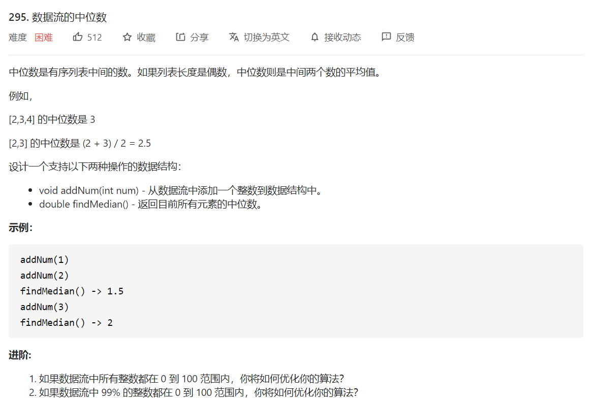

# NOIP基础数据结构与算法

>   https://www.bilibili.com/video/BV1qj411f7NL

## 1. 基础数据结构

### 二叉堆

插入维护时间为 $O(N)$ 。层数 $h = O(log\ n)$，$i$ 层 $2^i$ 个数字 $h-i$ 深, $\sum 2^i * (n-i) = O(log \ n)$

```c++
int w[200002];

void down(int k)
{
    int l = 2*k, r = 2*k + 1;
    if(w[l] < w[k] || w[r] < w[k])
    {
        // 和较小的孩子交换
        int t = (w[l] < w[r])? l: r;
        swap(w[k], w[t]);
        down(t);
    } 
}

void up(int k)
{
    while (k > 1 && w[k] < w[k>>1])
    {
        // 和父亲交换
        swap(w[k], w[k>>1]);
        up(k>>1);
    }
}
```



```go
// Go 手动实现堆，有 bug
const MAX_LEN int = 110000

type ArrayHeap struct {
	Data [MAX_LEN]int
	Cmp  func(ah *ArrayHeap, i, j int) bool
	Init int
}

func (ah *ArrayHeap) Down(k int) {
	if k > (*ah).Data[0] {
		return
	}
	l, r := 2*k, 2*k+1
	if (*ah).Cmp(ah, l, k) || (*ah).Cmp(ah, r, k) {
		if (*ah).Cmp(ah, l, k) {
			(*ah).Data[k], (*ah).Data[l] = (*ah).Data[l], (*ah).Data[k]
			ah.Down(l)
		} else {
			(*ah).Data[k], (*ah).Data[r] = (*ah).Data[r], (*ah).Data[k]
			ah.Down(r)
		}
	}
}

func (ah *ArrayHeap) Up(k int) {
	for k > 1 && (*ah).Cmp(ah, k, k>>1) {
		(*ah).Data[k], (*ah).Data[k>>1] = (*ah).Data[k>>1], (*ah).Data[k]
		ah.Up(k >> 1)
	}
}

func (ah *ArrayHeap) Add(val int) bool {
	if (*ah).Data[0]+1 == MAX_LEN {
		return false
	} else {
		(*ah).Data[0]++
		(*ah).Data[(*ah).Data[0]] = val
		(*ah).Up((*ah).Data[0])
		return true
	}
}

func (ah ArrayHeap) Len() int {
	return ah.Data[0]
}

func (ah ArrayHeap) Top() int {
	return ah.Data[1]
}

func (ah *ArrayHeap) Pop() {
	l := (*ah).Data[0]
	(*ah).Data[1], (*ah).Data[l] = (*ah).Data[l], (*ah).Init
	(*ah).Data[0]--
	(*ah).Down(1)
}

func (ah *ArrayHeap) Peek() int {
	ret := (*ah).Data[1]
	(*ah).Pop()
	return ret
}

func NewHeap(cmp func(ah *ArrayHeap, i, j int) bool, init int) ArrayHeap {
	data := [MAX_LEN]int{0}
	for i := 1; i < MAX_LEN; i++ {
		data[i] = init
	}
	return ArrayHeap{
		data,
		cmp,
		init,
	}
}

type MedianFinder struct {
	MaxHalf ArrayHeap
	MinHalf ArrayHeap
}

func minCmp(ah *ArrayHeap, i, j int) bool {
	return (*ah).Data[i] < (*ah).Data[j]
}

func maxCmp(ah *ArrayHeap, i, j int) bool {
	return (*ah).Data[i] > (*ah).Data[j]
}

/** initialize your data structure here. */
func Constructor() MedianFinder {
	return MedianFinder{
		NewHeap(minCmp, math.MaxInt32),
		NewHeap(maxCmp, math.MinInt32),
	}
}

func (this *MedianFinder) AddNum(num int) {
	if this.MinHalf.Len() == 0 || num < this.MinHalf.Top() {
		this.MinHalf.Add(num)
		if this.MinHalf.Len() > this.MaxHalf.Len()+1 {
			tmp := this.MinHalf.Peek()
			this.MaxHalf.Add(tmp)
		}
	} else {
		this.MaxHalf.Add(num)
		if this.MaxHalf.Len() > this.MinHalf.Len() {
			tmp := this.MaxHalf.Peek()
			this.MinHalf.Add(tmp)
		}
	}
}

func (this *MedianFinder) FindMedian() float64 {
	if this.MaxHalf.Len() == this.MinHalf.Len() {
		return float64(this.MaxHalf.Top()+this.MinHalf.Top()) / 2.0
	} else {
		return float64(this.MinHalf.Top())
	}
}
```


### 左偏树

定义一个树的斜深度为从根节点开始一直向右走到叶子节点的步数。左偏树是特殊的堆，满足左儿子大小不小于右儿子，关键操作：合并

每个节点斜深度 $O(log\ n)$

```c++
struct tree
{
    int l, r, size, w; // 权值
} t[110000];
// k1, k2 为根, 合并到 k1 为根, k2 合并为 k2 右儿子
int merge(int k1, int k2)
{
    if (k1 == 0 || k2 == 0) return k1 + k2;
    if (t[k1].w > t[k2].w) swap(k1, k2); // 小根堆
    t[k1].r = merge(t[k1].r, k2);
    // 满足左偏树性质
    if(t[t[k1].r].size > t[t[k1].l].size) swap(t[k1].l, t[k1].r);
    // 更新大小
    t[k1].size = t[t[k1].l].size + t[t[k1].r].size + 1;
    return k1;
}

// 插入变成和一个单节点左偏树合并
// 弹顶变成合并根的左右儿子
```

