# 数据结构与算法


## 1. 数据结构

### 1.1 二叉排序树

```c++
class Node
{
public:
    ElemType data;
    Node *left, *right;
    Node(ElemType _data, Node* _left, Node* _right)
        : data(_data), left(_left), right(_right)
    {}
};

typedef Node* BiTree;
```

#### 1.1.1 查找

```c++
BiTree SearchBST(BiTree root, KeyType target)
{
    if(!root.isEmpty() || target == root->data.key )
    {
        // 找到或者查找失败
        return root;
    }
    else if(root->data.key < target)
    {
        // 在左子树上查找
        return SearchBST(root->left, target);
    }
    else 
    {
        // 在右子树上查找
        return SearchBST(root->right, target);
    }
}
```

实际上二叉排序树在查找失败时应该确定目标的插入位置。

```c++
bool SearchBST(BiTree root, KeyType target, BiTree parrent, BiTree& ret)
{
    // 如果没找到，ret指向最后访问节点的双亲（即插入位置），返回false
    // 如果找到，ret指向查找结果
    if(!root.isEmpty())
    {
        ret = parrent;
        return false;
    }
    else if (target == root->data.key)
    {
        ret = root;
        return true;
    }
    else if (root->data.key < target)
    {
        return SearchBST(root->left, target, root, ret);
    }
    else
    {
        return SearchBST(root->right, target, root, ret);
    }
}
```

#### 1.1.2 插入元素

```c++
bool InsertBST(BiTree& root, ElemType elem)
{
    BiTree p;
    if(SearchBST(root, elem.key, nullptr, p))
    {
        // 如果元素已经存在，插入失败
        return false;
    }
    else
    {
        // p指向插入点
        Node node = new Node(elem, nullptr, nullptr);
        if(nullptr == p)
        {
            // 插入点就是根节点，说明之前是空树
            root = node;            
        }
        else if(p->data.key > elem.key)
        {
            p->left = node;
        }
        else
        {
            p->right = node;
        }
        return true;
    }
}
```

#### 1.1.3 删除元素


```c++
bool DeleteBST(BiTree& root, KeyType target)
{
    BiTree p;
    if(!SearchBST(root, target, nullptr, p))
    {
        // 没找到节点，直接退出
        return false;
    }
    else
    {
        return DeleteNode(p);
    }
}

bool DeleteNode(BiTree& p)
{
    if(nullptr == p->left)
    {
        // 没有左子树，重接右子树即可
        BiTree q = p;
        p = p->right;
        delete q;
	}
    else if(nullptr == p->right)
    {
        // 没有右子树，重接左子树即可
        BiTree q = p;
        p = p->left;
        delete q;
    }
    else
    {
        // 左孩子的右子树最终节点与待删除节点互换
        // 原左孩子右子树最终节点的左子树交给其父节点作为右子树
      	BiTree q = p;
        BiTree s = p->left;
        while(nullptr != s->right) 
        {
            q = s;
            s = s->right;
        }
        p->data = s->data;
        if(q != p) q->right = s->left;
        else q->left = s->left;
        delete s;
    }
    return true;
}
```


### 1.2 平衡二叉树 （ AVL Tree ） 

```c++
class AVLNode
{
  	ElemType data;
    int bf;		// 平衡因子
    AVLNode *left, *right;
    AVLNode(ElemType _data, int _bf, AVLNode* _left, AVLNode* _right)
        : data(_data), bf(_bf), left(_left), right(_right)
    {}
};

typedef AVLNode* AVLTree;
```

#### 1.2.1 失衡旋转


```c++
// rc: right child
// lc: left child

// 节点左旋
void LRotate(AVLTree& root)
{
    AVLTree rc = root->right;
    root->right = rc->left;
    rc->left = root;
    root = rc;
}

// 节点右旋
void RRotate(AVLTree& root)
{
    AVLTree lc = root->left;
    lc->right = root->left;
    lc->left = root;
    root = lc;
}
```

```c++
#define LH +1 // 左子树高
#define EH 0  // 等高
#define RH -1 // 右子树高

// 左平衡旋转
void LBalence(AVLTree& root)
{
    AVLTree lc = root->left;
    if(lc->bf == LH)
    {
        // LL型插入，做单右旋即可平衡
        root->bf = lc->bf = EH;
        RRotate(root);
    }
    else if(lc->bf == RH)
    {
        // LR型插入，先左后右旋转
        AVLTree lcrc = lc->right;
        switch(lcrc->bf)
        {
            case LH:
            {
                root->bf = RH;
                lc->bf = EH;
                break;
            }
            case EH:
            {
            	root->bf = lc->bf = EH;
                break;
            }
            case RH:
            {
            	root->bf = EH;
                lc->bf = RH;
                break;
            }
        }
        lcrc->bf = EH;
        LRotate(root->left);
        RRotate(root);
    }
}

void RBalence(AVLTree& root)
{
    AVLTree rc = root->right;
    if(rc->bf == RH)
    {
        // RR型插入，做单左旋即可平衡
        root->bf = rc->bf = EH;
        LRotate(root);
    }
    else if(rc->bf == LH)
    {
        // RL型插入，先右后左旋转
        AVLTree rclc = rc->left;
        {
            switch(rclc->bf)
            {
                case LH:
                {
                	root->bf = EH;
                    rc->bf = RH;
                    break;
                }
                case EH:
                {
                    root->bf = rc->bf = EH;
                   	break;
                }
                case RH:
                {
                	root->bf = LH;
                    rc->bf = EH;
               		break;
                }
            }
            rclc->bf = EH;
            RRotate(root->right);
            LRotate(root);
        }
    }
}
```

> 二叉排序树平衡因子的更改画示意图即可。

#### 1.2.2  删除元素

先按照 BST 的方法删除元素，然后重新处理平衡。

> TODO: BST 删除元素后重新平衡的 Code


### 1.3 红黑树 （ Red-Black Tree )

AVL 树虽然解决了普通二叉排序树畸形的问题，但是平衡操作过多。红黑树是一个自平衡（但不是绝对平衡）的 BST 。参考[这篇文章](https://www.cnblogs.com/skywang12345/p/3245399.html)。

#### 1.3.1 构造规则

- 每个节点都有红色或者黑色
- 树的根节点必为黑色
- 没有两个**相邻**的**红色节点**（红色节点不能有红色父节点或红色子节点。但是**并没有说不能出现连续的黑色节点**）
- `NULL` 节点视为黑色 
- 从任意节点（包括根节点）到其任何后代 `NULL` 节点的每条路径都具有**相同数量**的黑色节点

#### 1.3.2 插入节点

假设新插入节点为 X 。

1. 将新插入节点标记为红色

2. 如果 X 是根节点，则重新标记为黑色，结束

3. 如果 X 的父节点是红色，同时 X 也不是根节点
   - 如果 X 的叔叔节点是红色
     - 将父节点和叔叔节点标记为黑色
     - 将祖父节点标记为红色
     - 让 X 颜色与祖父节点颜色相同，将祖父节点设置为当前节点 X ，重复步骤 2 和步骤 3

   - 如果 X 的叔叔节点是黑色，且 X 是右孩子
     - 将父节点作为新的当前节点 X
     - 以 X 为支点进行左旋
     - 重复步骤 2 和步骤 3

   - 如果 X 的叔叔节点是黑色，且 X 是左孩子
     -  将父节点标记为黑色
     -  将祖父节点标记为红色
     -  以祖父节点作为支点进行右旋

> **注意：** 第 2 图和第 3 图有误。按照已有的图，插入节点 35R 后，节点 50R 和 75R 变为 50B 和 70B ，60B 变为 60R 并作为当前节点； 40R 和 120R 变为 40B 和 120B ，80B 变为 80R 并作为当前节点； 80R 变为 80B ，重染色结束。 如果要符合操作描述，节点 120R 应该为 120B (忽略树的不平衡)。

#### 1.3.3 删除节点

首先将 RBT 当作普通的 BST 找到待删除节点。分三种情况：

- 被删除节点是叶子节点，则直接删除
- 被删除节点只有一个子节点，则直接删除，并且用子节点替代原节点位置
- 被删除节点有两个子节点，则先找出后继节点，然后将后继节点的内容复制给被删除节点，之后删除后继节点。删除后继节点的情况必为上面两条之一。注意这一步的复制只复制内容，**不复制颜色**

删除节点后的树不一定满足红黑树的性质，因此要对树重新染色。假设删除节点 Y 之后，替代 Y 位置的节点为 X （ `NULL` 节点也算）。如果 Y 的颜色为黑色，则路径上少了一个黑节点，颜色平衡被破坏。因此我们假设 X 除了原本的颜色之外，还带有一个额外的黑色。假设 X 原本的颜色为 x ，我们用 xB 表示 X 现在的颜色。

- 如果 X 是 RB 节点，直接将 X 的颜色设置为黑色，红黑树性质即可恢复
- 如果 X 是 BB 节点且为根，什么都不做
- 如果 X 是 BB 节点且不为根

  - 如果 X 的兄弟节点是红色（此时 X 的父节点和 X 兄弟节点的子节点都是黑色）

    > 处理思路是将该情况转换为后面三种情况

    - 将 X 的兄弟节点设置为黑色
    - 将 X 的父节点设置为红色
    - 以 X 的父节点为支点左旋
    - 左旋后，更新 X 的兄弟节点

    

    > **注意：** 此图有误，旋转后 B 应该染红，D 应该染黑

  - 如果 X 的兄弟节点是黑色，且兄弟节点的两个孩子都是黑色

    > 处理思路是将 X 中多余的一个黑色往根方向移动。多余的黑色属性移动到 X 的父节点后，到 X 和其兄弟的路径上黑色节点数目不一致，因此将其兄弟染红，使其一致

    - 将 X 的兄弟节点设置为红色
    - 将 X 的父节点设置为新的 X 节点

    

  - 如果 X 的兄弟节点是黑色，兄弟节点的左孩子是红色，右孩子是黑色

    > 处理思路是将该情况转换为最后一种情况

    - 将 X 的兄弟节点的左孩子设置为黑色
    - 将 X 的兄弟节点设置为红色
    - 以 X 的兄弟节点为支点右旋
    - 右旋后，更新 X 的兄弟节点

    

  - 如果 X 的兄弟节点是黑色，兄弟节点的右孩子为红色（左孩子任意颜色均可）

    > 处理思路是去掉 X 中的额外黑色，将 X 变成单独的黑色

    - 将 X 的父节点颜色赋值给 X 的兄弟节点
    - 将 X 的父节点设置为黑色
    - 将 X 兄弟节点的右孩子设置为黑色
    - 以 X 的父节点为支点左旋
    - 将根节点设置为 X

    


### 1.4 B 树

#### 1.4.1 构造规则

B 树是多路平衡查找树，m 阶 B 树的定义如下。

- 树中每个节点至多有 m 棵子树
- 每个节点最多有 m-1 个关键字 （可以存有的键值对）
- 根节点最少可以只有 1 个关键字
- 非根节点至少有 $\lceil m/2\rceil$ 棵子树
- 每个节点中的关键字都按照从小到大的顺序排列。每个关键字的左子树中所有关键字都小于它，而右子树中所有的关键字都大于它
- 所有的叶子节点位于同一层，并且不带任何信息

因此根节点的**关键字**范围是 $1\leq k\leq m-1$ ，非根节点的**关键字**范围是 $\lceil m/2\rceil\leq k\leq m-1$ 。一棵 4 阶 B 树的示例图如下。

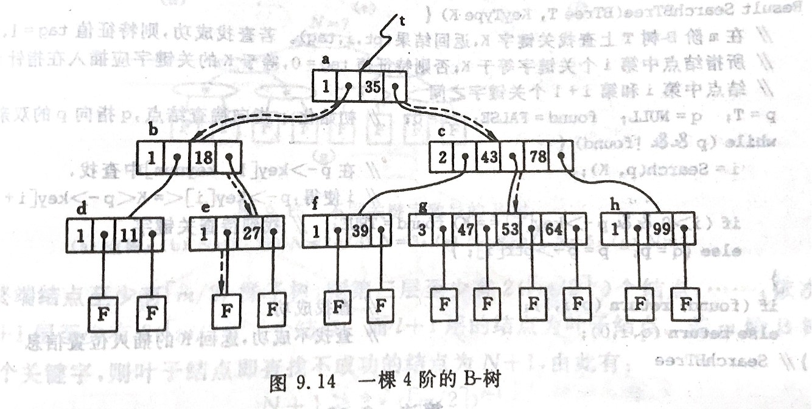

#### 1.4.2 插入节点

>   B 树的插入删除可以参考[这篇文章](https://zhuanlan.zhihu.com/p/83028825)

B 树的插入首先要找到最底层的某个非终端节点。如果添加后节点的关键字个数超过 $m-1$ ，则要产生节点的“分裂”。一个 3 阶 B 树的插入过程示例图如下。


#### 1.4.3 删除节点

在 B 树上删除一个关键字，首先查找到关键字所在节点并删除该关键字。然后

-   如果该节点是最下层节点，且关键字数目不小于 $\lceil m/2\rceil - 1$ ，则删除结束。如下图所示：

	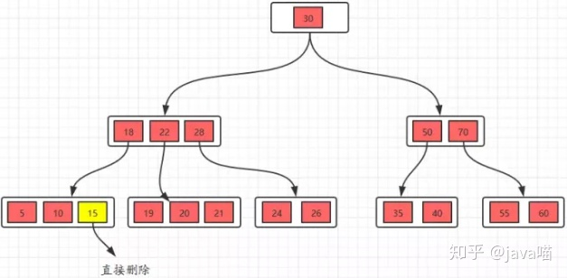

-   如果节点不是最下层节点，删除时需要用后继节点替代，如下图所示

	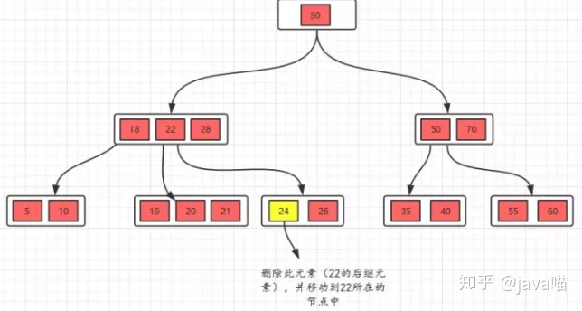

	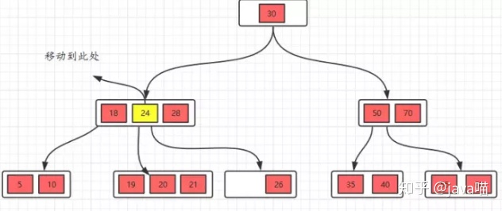

	-   如果替代后，最下层节点的关键字数目不小于 $\lceil m/2\rceil$ ，则删除结束
	
	- 如果替代后，最下层节点的关键字数目小于 $\lceil m/2\rceil - 1$ ，则需要从其兄弟节点处借用一个关键字，该借用过程需要通过父节点进行。具体如图所示
	
	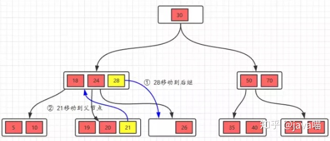
	
	-   如果兄弟节点自己的关键字数目也不够，没法借用，那么要进行节点合并。具体如图所示
	
	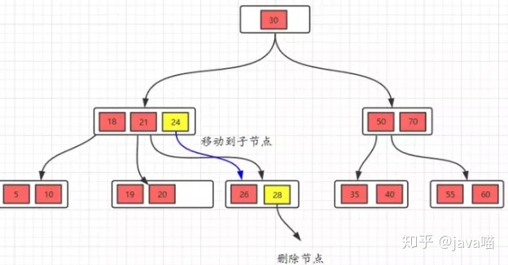
	
	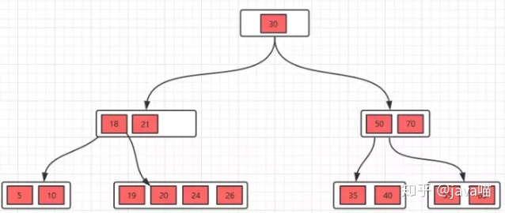
	
	
	
	

### 1.5 B$^+$ 树

B$^+$ 树是 B 树的变种。图示是一棵 3 阶 B$^+$ 树。

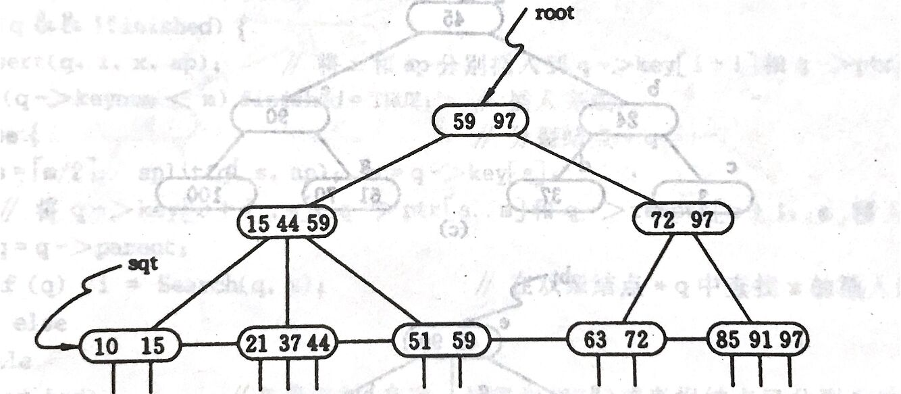

#### 1.5.1 与 B 树的异同

-   相同点
    -   根节点至少有一个关键字
    -   非根节点的关键字范围 $m/2 \leq k\leq m-1$
-   不同点
    -   B$^+$ 树有两种类型的节点：内部节点（索引节点）和叶子节点。内部节点不储存数据，只储存索引，数据都储存在叶子节点
    -   内部节点和叶子节点中的关键字按从小到大的顺序排列
    -   每个叶子节点都存有相邻叶子节点的指针，叶子节点本身依照关键字大小自小到大排序
    -   父节点存有其子节点中最大或最小关键字
    -   通常使用 B$^+$ 树时会有两个头指针，一个指向根节点，另一个指向最小关键字的叶子节点

#### 1.5.2 插入节点

-   B$^+$ 树的插入只在叶子节点上进行
-   当节点中的关键字多于 $m-1$ 时，分裂节点并更新父节点

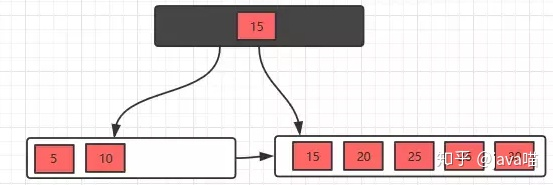

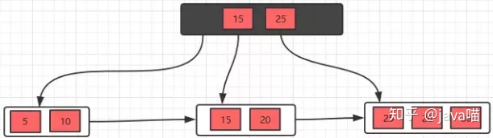

#### 1.5.3 删除节点

-   删除节点的操作类似 B 树
-   删除关键字后，如果关键字数目少于 $\lceil m/2\rceil - 1$ ，借用节点时直接通过兄弟节点即可，然后修改父节点的索引。如图所示（父节点记录最小关键字）

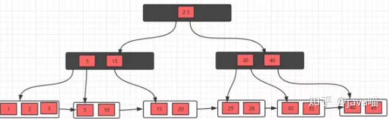

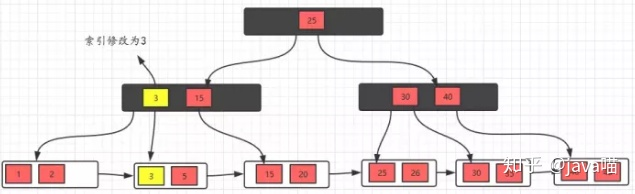

-   如果关键字数目少于 $\lceil m/2\rceil - 1$ 且左右兄弟都无关键字可借，则合并叶子节点

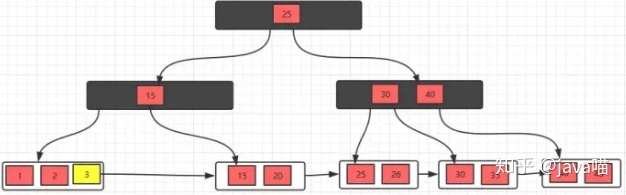

#### 1.5.4 B$^+$ 树相对 B 树的优势

-   单一节点储存的元素更多，使得查询的 IO 次数更少
-   所有的查询都要查找到叶子节点，查询性能是稳定的
-   所有的叶子节点形成了一个有序链表，更加便于查找


### 1.6 B$^*$ 树

B$^*$ 树是 B$^+$ 树的变体。B$^+$ 树的块最低使用率是 1/2 ，B$^*$ 树的块最低使用率是 2/3 。B$^*$ 树的非根非叶子节点也添加了指向兄弟的指针。如图所示


B*树的分裂

-   当一个结点满时，如果它的下一个兄弟结点未满，那么将一部分数据移到兄弟结点中，再在原结点插入关键字，最后修改父结点中兄弟结点的关键字（因为兄弟结点的关键字范围改变了）

-   如果兄弟也满了，则在原结点与兄弟结点之间增加新结点，并各复制1/3的数据到新结点，最后在父结点增加新结点的指针


### 1.7 前缀树

前缀树又称字典树，用于保存关联数组，其中的键通常是字符串。

#### 1.7.1 构造规则

-   根节点不包含字符，除根节点以外每个节点只包含一个字符
-   从根节点到某一节点，路径上经过的字符连接起来是该节点对应的字符串
-   每个节点的所有子节点包含的字符串不相同

#### 1.7.2 多重链表实现（Trie 树）

用多重链表实现的前缀树又称 Trie 树，如下图所示

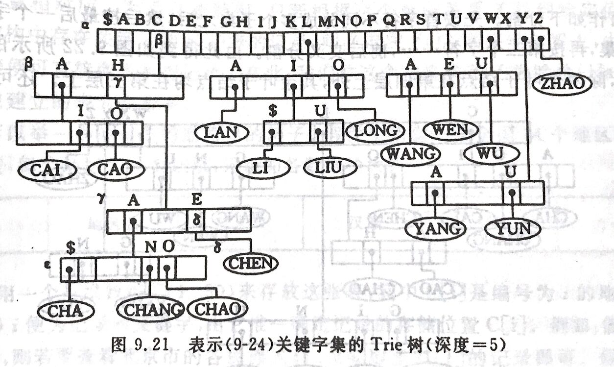

具体实现的程序如下

```c++
constexpr auto MAX_KEY_LEN = 16;	// 关键字最大长度
enum class NodeKind { Leaf, Branch };
struct KeysType
{
    char ch[MAX_KEY_LEN]; // 关键字
    int len; 			 // 关键字长度
};

struct TrieNode
{
    NodeKind kind;
    union
    {
        struct {KeysType key; Record* value;} leaf; 	// 叶子节点
        struct {TrieNode* ptr[27]; int num;}  branch; 	// 分支节点
    }
};
typedef TrieNode* TrieTree;

inline int GetIndex(char c) { return c-64; }

// 查找操作
Record* SearchTrieTree(TrieTree T, KeysType K)
{
    TrieNode* p = T;
    int i = 0;
    while(p && p->kind == NodeKind::Branch && i < K.len)
    // 对K的每个字符逐个查找，不满足条件则跳出
    {
        p = p->branch.ptr[GetOrder(K.ch[i])];
        ++i;
    }
    if (p && p->kind == NodeKind::Leaf && p->leaf.key == K) // 查找成功
    {
        return p->leaf.value;
    }
    else // 查找失败
    {
        return nullptr;
    }
}
```


### 1.8 并查集

并查集是支持一组互不相交集合的数据结构，通常用森林实现。开始时让每个元素构成一个单元素的集合，然后按一定顺序将属于同一组的元素所在的集合合并，期间要反复查找元素在哪个集合中。并查集常用的操作有初始化，查找元素所属集合 `Find` 和合并子集 `Bind` 。

#### 1.8.1 parent 数组实现

我们用 parent  数组来表示树。数组下标表示树的一个节点，下标所对应的值表示树的父节点，并规定树的根节点以自己为父节点（即 parent 中的元素值为下标本身）。

假设待查找元素为 x ，查找操作只需要比较 x 的父节点是否为其自身。代码如下

```c++
int Find(int x) { return x == parent[x]? x: Find(parent[x]); }
```

对于合并操作，分别找到两个元素的根节点，然后使其中一个根节点的父节点为另一个根节点即可。代码如下

```c++
void Union(int x1, int x2)
{
    int p1 = Find(x1);
    int p2 = Find(x2);
    parent[p1] = p2;
}
```

并查集的完整实现如下

```c++
class DisjointSet
{
private:
    std::vector<int> parent;
    
public:
    DisjointSet(int max_size) : parent(std::vector<int>(max_size))
    {
        for(int i = 0; i < max_size; ++i)
        {
            parent[i] = i;
        }
	}
    
    int Find(int x)
    {
        return x == parent[x]? x: Find(parent[x]);
    }
    
    void Union(int x1, int x2)
    {
        parent[Find(x1)] = Find(x2);
    }
    
    bool IsSameSubset(int x1, int x2)
    {
        return Find(x1) == Find(x2);
    }
};
```

#### 1.8.2 优化

对上面的实现，因为没有对树进行特殊处理，所以树的不断合并可能导致树的严重不平衡，最坏情况会使查找操作的复杂度达到 $O(N)$ 。有两种优化思路。

-   按秩合并：秩为 $r$ 的树高度上界为 $r+1$ ，只有一个节点的树秩记为 0 。两棵树合并时，如果秩不相等，则将秩小的树合并到秩大的树上。如果相等，两棵树任意合并，秩 +1 
-   路径压缩：在执行查找操作的过程中，将路径上的所有节点直接连到根节点上

可以证明，同时使用这两种方法的平均复杂度为 $O(\alpha(N))$ ，其中 $\alpha(N)$ 是阿克曼函数的反函数。优化后的并查集实现如下

```c++
class DisjointSet
{
private:
    std::vector<int> parent;
    std::vector<int> rank;
    
public:
    DisjointSet(int max_size) : parent(std::vector<int>(max_size)), rank(std::vector<int>(max_size, 0))
    {
        for(int i = 0; i < max_size; ++i)
        {
            parent[i] = i;
        }
    }
    
    int Find(int x)
    {
        return x == parent[x]? x: (parent[x] == Find(parent[x]));
    }
    
    void Union(int x1, int x2)
    {
        int f1 = Find(x1);
        int f2 = Find(x2);
        if(rank[f1] > rank[f2])
        {
            parent[f2] = f1;
        }
        else
        {
            parent[f1] = f2;
            if(rank[f1] == rank[f2])
            {
                ++rank[f2];
            }
        }
    }
    
    bool IsSameSubset(int x1, int x2)
    {
        return Find(x1) == Find(x2);
    }  
};
```


## 2. 算法

### 2.1 直接插入排序

#### 2.1.1 原理

设待排序序列为 v 。先将序列中第 1 个记录看成是有序的子序列，然后从第 2 个记录开始逐个进行插入。在自 $i-1$ 起往前搜索的过程中，可以同时后移记录。

#### 2.1.2 复杂度

$O(N^2)$ 

数组基本有序时，直接插入排序效率最高。

#### 2.1.3 实现

```c++
void InsertSort(std::vector<int>& v)
{
    int len = v.size();
    int flag = 0;
    for (int i = 1; i < len; ++i)
    {
        if(v[i] < v[i-1])
        {
            flag = v[i];
            v[i] = v[i-1];
            int j = 0;
            // 如果插入第 2 个元素，j 越界，此时不需要做任何操作
            // 可以通过把 flag 设置在 v[0] 避免对 j 的特判
            // 相应的数组长度要改为 <= len
            for(j = i-2; j>=0 && (v[j] > flag); --j)
            {
                v[j+1] = v[j];
            }
            v[j+1] = flag;
        }
    }
}
```


### 2.2 Shell 排序

#### 2.2.1 原理

希尔排序先将整个待排序序列分为若干子序列，分别进行直接插入排序，当整个序列基本有序时，再对全体进行一次直接插入排序。如图所示

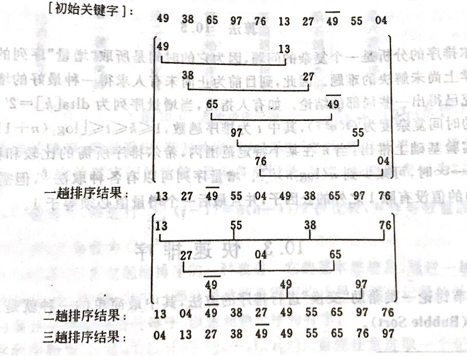

#### 2.2.2 复杂度

大约为 $O(N^{1.3})$


### 2.3 冒泡排序

#### 2.3.1 原理

比较相邻记录，如果逆序则交换之。

#### 2.3.2 复杂度

平均 $O(N^2)$

#### 2.3.3 实现

```c++
void BubbleSort(std::vector<int>& v)
{
    bool flag = false;
    int len = v.size();
    for(int i = 1; i < len; ++i)
    {
        flag = false;
        for(int j = 0; j < len-i; ++j)
        {
            if(v[j] > v[j+1])
            {
                std::swap(v[j], v[j+1]);
                flag = true;
            }
        }
        if(!flag) break;
    }
}
```


### 2.4 快速排序

#### 2.4.1 原理

通过一趟排序，将待排序记录分割为独立的两部分，其中一部分的关键字均比另一部分的关键字小。对这两个部分递归调用快速排序，以达到整个序列有序。

附设两个指针 low 和 high 。假设枢轴记录的关键字为 pivotkey ，先从 high 指定位置向前找到第一个小于 pivotkey 的记录并与 pivotkey 交换，再从 low 指定位置向后找到第一个关键字大于 pivotkey 的记录并与 pivotkey 交换，直到 low 和 high 重合。可以将 pivotkey 暂存，直到一趟排序结束后再将 pivotkey 移动到正确位置，并返回该位置。示意图如下

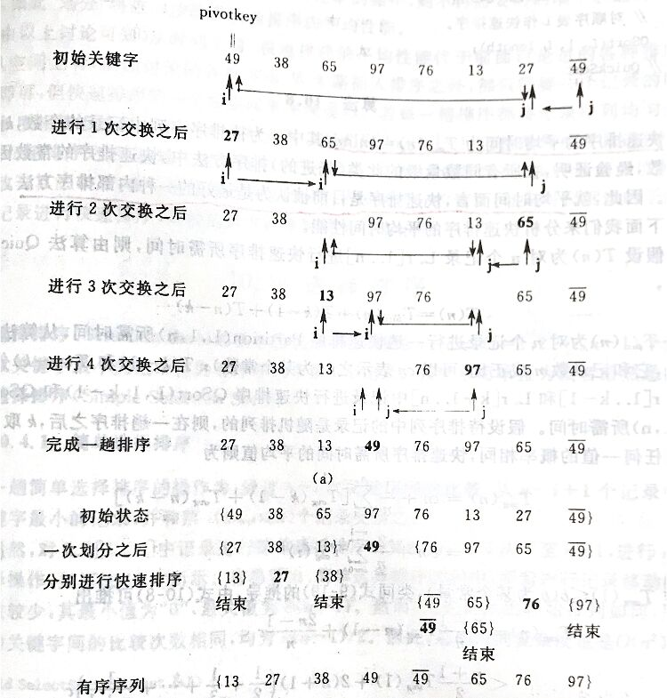

#### 2.4.2 复杂度

平均复杂度为 $O(N log N)$ ，最坏情况复杂度为 $O(N^2)$

#### 2.4.3 实现

```c++
int Partition(std::vector<int>& v, int low, int high)
{
    int pivotkey = v[low];
    while(low < high)
    {
        while(low < high && v[high] >= pivotkey) --high;
        v[low] = v[high];
        while(low < high && v[low] <= pivotkey) ++low;
        v[high] = v[low];
    }
    v[low] = pivotkey;
    return low;
}

void QuickSort(std::vector<int>& v, int low, int high)
{
    if(low < high)
    {
        int pivotloc = Partition(v, low, high);
        QuickSort(v, low, pivotloc-1);
        QuickSort(v, pivotloc+1, high);
    }
}

void QuickSort(std::vector<int>& v)
{
    QuickSort(v, 0, v.size()-1);
}
```

如果在一趟排序后比对两边的长度，并优先对较短部分进行快速排序，栈最大深度可下降为 $O(log N)$ 。


### 2.5 归并排序

#### 2.5.1 原理

将初始序列看成 n 个有序的子序列，再两两归并。迭代进行该步骤直到整个序列有序。二路归并的示意图如下

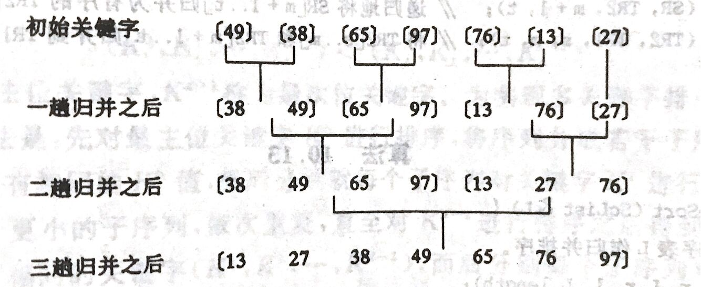

#### 2.5.2 复杂度

二路归并的时间复杂度为 $O(NlogN)$

#### 2.5.3 实现

-   递归实现

>   递归形式的二路归并实用性很差

```c++
void Merge(std::vector<int>& v, int left, int mid, int right)
{
    // 复制分割点左右数组到临时数组
    // 比void Merge(std::vector<int>& lhs, std::vector<int>& rhs, int left, int mid, int right)清晰
    std::vector<int> lhs(v.begin()+left, v.begin()+mid+1);
    std::vector<int> rhs(v.begin()+mid+1, v.begin()+right+1);
    // 插入哨兵，避免检测数组是否为空
    lhs.push_back(INT_MAX);
    rhs.push_back(INT_MAX);
    int l = 0, r = 0;
    for(int i = left; i <= right; ++i)
    {
        if(lhs[l] < rhs[r]) v[i] = lhs[l++];
        else v[i] = rhs[r++];
    }
}

void MergeSort(std::vector<int>& v, int left, int right)
{
    if(left < right)
    {
        int mid = left + (right-left)/2;
        MergeSort(v, left, mid);
        MergeSort(v, mid+1, right);
        Merge(v, left, mid, right);
    }
}

void MergeSort(std::vector<int>& v)
{
    MergeSort(v, 0, v.size()-1);
}

int main()
{
    std::vector<int> v = {0, 1, 9, 8, 2, 4, 6, 7, 5, 10, 15, 11, 14, 12, 3, 13};
    MergeSort(v);
    for(auto i: v) std::cout << i << " ";
    std::cout << std::endl;
    return 0; 
}
```

-   非递归实现

>   非递归实现从间隔 1 开始，每次归并后间隔变为 2 倍，直到间隔达到长度的一半

```c++
void Merge(std::vector<int>& v, int left, int mid, int right)
{
    std::vector<int> lhs(v.begin()+left, v.begin()+mid+1);
    std::vector<int> rhs(v.begin()+mid+1, v.begin()+right+1);
    // 插入哨兵，避免检测数组是否为空
    lhs.push_back(INT_MAX);
    rhs.push_back(INT_MAX);
    int l = 0, r = 0;
    for(int i = left; i <= right; ++i)
    {
        if(lhs[l] < rhs[r]) v[i] = lhs[l++];
        else v[i] = rhs[r++];
    }
}

void MergeSort2(std::vector<int>& v)
{
    int len = v.size();
    for(int seg = 1; seg < len; seg <<= 1)
    {
        for(int left = 0; left < len; left += 2*seg)
        {
            int mid = left + seg - 1;
            int right = std::min(left + 2*seg - 1, len);
            Merge(v, left, mid, right);
        }
    }
}
```


