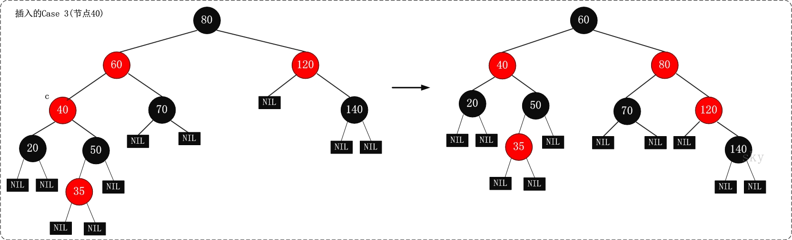
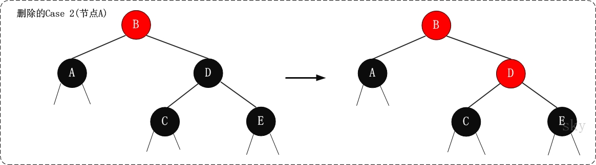
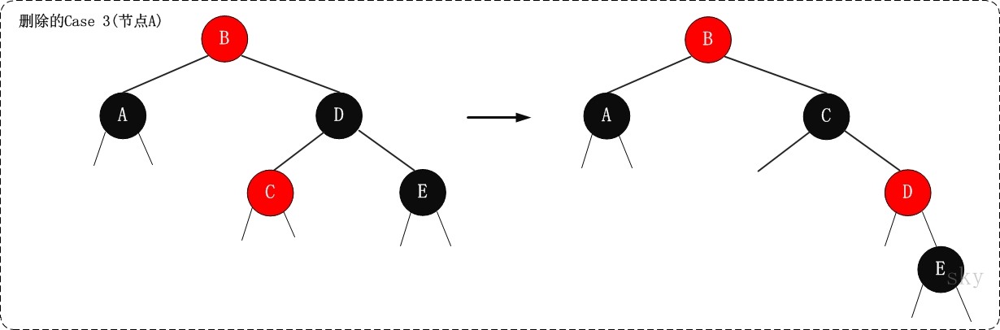

# 数据结构与算法

> ```c++
> /*
>                    _ooOoo_
>                   o8888888o
>                   88" . "88
>                   (| -_- |)
>                   O\  =  /O
>                ____/`---'\____
>              .'  \\|     |//  `.
>             /  \\|||  :  |||//  \
>            /  _||||| -:- |||||-  \
>            |   | \\\  -  /// |   |
>            | \_|  ''\---/''  |   |
>            \  .-\__  `-`  ___/-. /
>          ___`. .'  /--.--\  `. . __
>       ."" '<  `.___\_<|>_/___.'  >'"".
>      | | :  `- \`.;`\ _ /`;.`/ - ` : | |
>      \  \ `-.   \_ __\ /__ _/   .-` /  /
> ======`-.____`-.___\_____/___.-`____.-'======
>                    `=---='
> ^^^^^^^^^^^^^^^^^^^^^^^^^^^^^^^^^^^^^^^^^^^^^
>             佛祖保佑       永无BUG
> */
> ```


## 1. 数据结构

### 1.1 二叉排序树

```c++
class Node
{
public:
    ElemType data;
    Node *left, *right;
    Node(ElemType _data, Node* _left, Node* _right)
        : data(_data), left(_left), right(_right)
    {}
};

typedef Node* BiTree;
```

#### 1.1.1 查找

```c++
BiTree SearchBST(BiTree root, KeyType target)
{
    if(!root.isEmpty() || target == root->data.key )
    {
        // 找到或者查找失败
        return root;
    }
    else if(root->data.key < target)
    {
        // 在左子树上查找
        return SearchBST(root->left, target);
    }
    else 
    {
        // 在右子树上查找
        return SearchBST(root->right, target);
    }
}
```

实际上二叉排序树在查找失败时应该确定目标的插入位置。

```c++
bool SearchBST(BiTree root, KeyType target, BiTree parrent, BiTree& ret)
{
    // 如果没找到，ret指向最后访问节点的双亲（即插入位置），返回false
    // 如果找到，ret指向查找结果
    if(!root.isEmpty())
    {
        ret = parrent;
        return false;
    }
    else if (target == root->data.key)
    {
        ret = root;
        return true;
    }
    else if (root->data.key < target)
    {
        return SearchBST(root->left, target, root, ret);
    }
    else
    {
        return SearchBST(root->right, target, root, ret);
    }
}
```

#### 1.1.2 插入元素

```c++
bool InsertBST(BiTree& root, ElemType elem)
{
    BiTree p;
    if(SearchBST(root, elem.key, nullptr, p))
    {
        // 如果元素已经存在，插入失败
        return false;
    }
    else
    {
        // p指向插入点
        Node node = new Node(elem, nullptr, nullptr);
        if(nullptr == p)
        {
            // 插入点就是根节点，说明之前是空树
            root = node;            
        }
        else if(p->data.key > elem.key)
        {
            p->left = node;
        }
        else
        {
            p->right = node;
        }
        return true;
    }
}
```

#### 1.1.3 删除元素


```c++
bool DeleteBST(BiTree& root, KeyType target)
{
    BiTree p;
    if(!SearchBST(root, target, nullptr, p))
    {
        // 没找到节点，直接退出
        return false;
    }
    else
    {
        return DeleteNode(p);
    }
}

bool DeleteNode(BiTree& p)
{
    if(nullptr == p->left)
    {
        // 没有左子树，重接右子树即可
        BiTree q = p;
        p = p->right;
        delete q;
	}
    else if(nullptr == p->right)
    {
        // 没有右子树，重接左子树即可
        BiTree q = p;
        p = p->left;
        delete q;
    }
    else
    {
        // 左孩子的右子树最终节点与待删除节点互换
        // 原左孩子右子树最终节点的左子树交给其父节点作为右子树
      	BiTree q = p;
        BiTree s = p->left;
        while(nullptr != s->right) 
        {
            q = s;
            s = s->right;
        }
        p->data = s->data;
        if(q != p) q->right = s->left;
        else q->left = s->left;
        delete s;
    }
    return true;
}
```


### 1.2 平衡二叉树 （ AVL Tree ） 

```c++
class AVLNode
{
  	ElemType data;
    int bf;		// 平衡因子
    AVLNode *left, *right;
    AVLNode(ElemType _data, int _bf, AVLNode* _left, AVLNode* _right)
        : data(_data), bf(_bf), left(_left), right(_right)
    {}
};

typedef AVLNode* AVLTree;
```

#### 1.2.1 失衡旋转


```c++
// rc: right child
// lc: left child

// 节点左旋
void LRotate(AVLTree& root)
{
    AVLTree rc = root->right;
    root->right = rc->left;
    rc->left = root;
    root = rc;
}

// 节点右旋
void RRotate(AVLTree& root)
{
    AVLTree lc = root->left;
    lc->right = root->left;
    lc->left = root;
    root = lc;
}
```

```c++
#define LH +1 // 左子树高
#define EH 0  // 等高
#define RH -1 // 右子树高

// 左平衡旋转
void LBalence(AVLTree& root)
{
    AVLTree lc = root->left;
    if(lc->bf == LH)
    {
        // LL型插入，做单右旋即可平衡
        root->bf = lc->bf = EH;
        RRotate(root);
    }
    else if(lc->bf == RH)
    {
        // LR型插入，先左后右旋转
        AVLTree lcrc = lc->right;
        switch(lcrc->bf)
        {
            case LH:
            {
                root->bf = RH;
                lc->bf = EH;
                break;
            }
            case EH:
            {
            	root->bf = lc->bf = EH;
                break;
            }
            case RH:
            {
            	root->bf = EH;
                lc->bf = RH;
                break;
            }
        }
        lcrc->bf = EH;
        LRotate(root->left);
        RRotate(root);
    }
}

void RBalence(AVLTree& root)
{
    AVLTree rc = root->right;
    if(rc->bf == RH)
    {
        // RR型插入，做单左旋即可平衡
        root->bf = rc->bf = EH;
        LRotate(root);
    }
    else if(rc->bf == LH)
    {
        // RL型插入，先右后左旋转
        AVLTree rclc = rc->left;
        {
            switch(rclc->bf)
            {
                case LH:
                {
                	root->bf = EH;
                    rc->bf = RH;
                    break;
                }
                case EH:
                {
                    root->bf = rc->bf = EH;
                   	break;
                }
                case RH:
                {
                	root->bf = LH;
                    rc->bf = EH;
               		break;
                }
            }
            rclc->bf = EH;
            RRotate(root->right);
            LRotate(root);
        }
    }
}
```

> 二叉排序树平衡因子的更改画示意图即可。

#### 1.2.2  删除元素

先按照 BST 的方法删除元素，然后重新处理平衡。

> TODO: BST 删除元素后重新平衡的 Code


### 1.3 红黑树 （ Red-Black Tree )

AVL 树虽然解决了普通二叉排序树畸形的问题，但是平衡操作过多。红黑树是一个自平衡（但不是绝对平衡）的 BST 。参考[这篇文章](https://www.cnblogs.com/skywang12345/p/3245399.html)。

#### 1.3.1 构造规则

- 每个节点都有红色或者黑色
- 树的根节点必为黑色
- 没有两个**相邻**的**红色节点**（红色节点不能有红色父节点或红色子节点。但是**并没有说不能出现连续的黑色节点**）
- `NULL` 节点视为黑色 
- 从任意节点（包括根节点）到其任何后代 `NULL` 节点的每条路径都具有**相同数量**的黑色节点

#### 1.3.2 插入节点

假设新插入节点为 X 。

1. 将新插入节点标记为红色

2. 如果 X 是根节点，则重新标记为黑色，结束

3. 如果 X 的父节点是红色，同时 X 也不是根节点
   - 如果 X 的叔叔节点是红色
     - 将父节点和叔叔节点标记为黑色
     - 将祖父节点标记为红色
     - 让 X 颜色与祖父节点颜色相同，将祖父节点设置为当前节点 X ，重复步骤 2 和步骤 3

   - 如果 X 的叔叔节点是黑色，且 X 是右孩子
     - 将父节点作为新的当前节点 X
     - 以 X 为支点进行左旋
     - 重复步骤 2 和步骤 3

   - 如果 X 的叔叔节点是黑色，且 X 是左孩子
     -  将父节点标记为黑色
     -  将祖父节点标记为红色
     -  以祖父节点作为支点进行右旋

> **注意：** 第 2 图和第 3 图有误。按照已有的图，插入节点 35R 后，节点 50R 和 75R 变为 50B 和 70B ，60B 变为 60R 并作为当前节点； 40R 和 120R 变为 40B 和 120B ，80B 变为 80R 并作为当前节点； 80R 变为 80B ，重染色结束。 如果要符合操作描述，节点 120R 应该为 120B (忽略树的不平衡)。

#### 1.3.3 删除节点

首先将 RBT 当作普通的 BST 找到待删除节点。分三种情况：

- 被删除节点是叶子节点，则直接删除
- 被删除节点只有一个子节点，则直接删除，并且用子节点替代原节点位置
- 被删除节点有两个子节点，则先找出后继节点，然后将后继节点的内容复制给被删除节点，之后删除后继节点。删除后继节点的情况必为上面两条之一。注意这一步的复制只复制内容，**不复制颜色**

删除节点后的树不一定满足红黑树的性质，因此要对树重新染色。假设删除节点 Y 之后，替代 Y 位置的节点为 X （ `NULL` 节点也算）。如果 Y 的颜色为黑色，则路径上少了一个黑节点，颜色平衡被破坏。因此我们假设 X 除了原本的颜色之外，还带有一个额外的黑色。假设 X 原本的颜色为 x ，我们用 xB 表示 X 现在的颜色。

- 如果 X 是 RB 节点，直接将 X 的颜色设置为黑色，红黑树性质即可恢复
- 如果 X 是 BB 节点且为根，什么都不做
- 如果 X 是 BB 节点且不为根

  - 如果 X 的兄弟节点是红色（此时 X 的父节点和 X 兄弟节点的子节点都是黑色）

    > 处理思路是将该情况转换为后面三种情况

    - 将 X 的兄弟节点设置为黑色
    - 将 X 的父节点设置为红色
    - 以 X 的父节点为支点左旋
    - 左旋后，更新 X 的兄弟节点

    

    > **注意：** 此图有误，旋转后 B 应该染红，D 应该染黑

  - 如果 X 的兄弟节点是黑色，且兄弟节点的两个孩子都是黑色

    > 处理思路是将 X 中多余的一个黑色往跟方向移动。多余的黑色属性移动到 X 的父节点后，到 X 和其兄弟的路径上黑色节点数目不一致，因此将其兄弟染红，使其一致

    - 将 X 的兄弟节点设置为红色
    - 将 X 的父节点设置为新的 X 节点

    

  - 如果 X 的兄弟节点是黑色，兄弟节点的左孩子是红色，右孩子是黑色

    > 处理思路是将该情况转换为最后一种情况

    - 将 X 的兄弟节点的左孩子设置为黑色
    - 将 X 的兄弟节点设置为红色
    - 以 X 的兄弟节点为支点右旋
    - 右旋后，更新 X 的兄弟节点

    

  - 如果 X 的兄弟节点是黑色，兄弟节点的右孩子为红色（左孩子任意颜色均可）

    > 处理思路是去掉 X 中的额外黑色，将 X 变成单独的黑色

    - 将 X 的父节点颜色赋值给 X 的兄弟节点
    - 将 X 的父节点设置为黑色
    - 将 X 兄弟节点的右孩子设置为黑色
    - 以 X 的父节点为支点左旋
    - 将根节点设置为 X

    


### 1.4 B 树


### 1.5 B$^+$ 树


### 1.6 B$^*$ 树


### 1.7 并查集


### 1.8 Hash 链表


