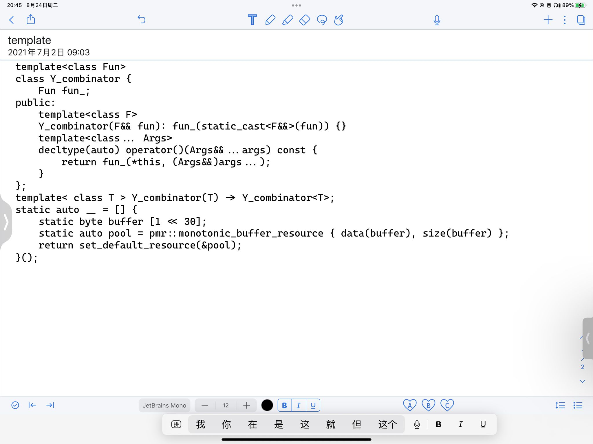

# 函数式编程概念 C++ 实现

## 0. $\lambda$ 演算

[lambda演算 - 知乎 (zhihu.com)](https://zhuanlan.zhihu.com/p/87209045)

## 什么是lambda演算

计算机科学，尤其是编程语言，经常倾向于使用一种特定的演算：Lambda演算（Lambda Calculus）。这种演算也广泛地被逻辑学家用于学习计算和离散数学的结构的本质。

## lambda演算的语法

1.  函数定义：Lambda演算中的函数是一个表达式，写成：lambda x . body，表示“一个参数参数为x的函数，它的返回值为body的计算结果。” 这时我们说：Lambda表达式绑定了参数x。

```js
// js描述 

x => body;
```

1.  标识符引用（Identifier reference）：标识符引用就是一个名字，这个名字用于匹配函数表达式中的某个参数名。
2.  函数应用（Function application）：函数应用写成把函数值放到它的参数前面的形式，如(lambda x . plus x x) y。

```text
// js描述 

const lambda = x => plus(x, x);  lambda(y);
```

### lambda演算中的自由标识符和绑定标识符

介绍Beta规约前我们需要了解lambda的标识符的概念。

如果一个标识符是一个闭合Lambda表达式的参数，我们则称这个标识符是绑定标识符；如果一个标识符在任何封闭上下文中都没有绑定，那么它被称为自由标识符。

例子：

-   lambda x . plus x y：在这个表达式中，y和plus是自由的，因为他们不是任何闭合的Lambda表达式的参数；而x是绑定的，因为它是函数定义的闭合表达式plus x y的参数。
-   lambda y . (lambda x . plus x y)：在内层演算lambda x . plus x y中，y和plus是自由的，x是绑定的。在完整表达中，x和y是绑定的：x受内层绑定，而y由剩下的演算绑定。plus仍然是自由的。

```text
// js描述 

x => plus(x, y); // x是绑定标识符，y和plus函数是自由标识符

y => x => plus(x, y); // 在内层函数中x是绑定标识符，y和plus函数是自由标识符。在整个函数中x和y是绑定标识符，plus函数是自由标识符。
```

## Lambda演算运算法则

Lambda演算只有两条真正的法则：称为Alpha和Beta。Alpha也被称为「转换」，Beta也被称为「规约」。

### Alpha转换

Alpha是一个重命名操作; 基本上就是说，变量的名称是不重要的：给定Lambda演算中的任意表达式，我们可以修改函数参数的名称，只要我们同时修改函数体内所有对它的自由引用。

例子：

```text
;scheme描述  

lambda (x) (+ 1 x)  

;我们可以将x换成y，并不会更改表达式的含义  

lambda (y) (+ 1 y)
```


```text
// js描述 

x => x + 1;  

// 我们可以将x换成y，并不会更改表达式的含义 

y => y + 1;
```

**通过Alpha转换我们可以实现递归等循环操作**

### Beta规约

我们在应用lambda表达式时，在不引起绑定标识符和自由标识符之间的任何冲突的情况下，可以用参数值对lambda演算中对应的标识符相关的部分做替换，替换方法是把标识符用参数值替换。

例子：

假设我们有一个函数应用表达式：`(lambda x . x + 1) 3`。所谓Beta规约就是，我们可以通过替换函数体（即“x + 1”）来实现函数应用，用数值“3”取代引用的参数“x”。于是Beta规约的结果就是“3 + 1”。

复杂点的例子：`(lambda x y. x y) (lambda z . z * z) 3`这是一个有两个参数的函数，它(的功能是)把第一个参数应用到第二个参数上。当我们运算时，我们替换第一个函数体中的参数“x”为`lambda z . z * z`；然后我们用“3”替换参数“y”，得到：`(lambda z . z * z) 3`。 再执行Beta规约，有“3 * 3”。

遇到标识符冲突时，我们可以使用Alpha转换：

(lambda z . (lambda x . x + z)) (x + 2) 3 // 我们先执行Alpha转换上面的表达式等价于下面的： (lambda z . (lambda y . y + z)) (x + 2) // 然后执行Beta规约 ==> (lambda y . y + (x + 2))


### eta规约

两个lambda算子若对于相同的输入产生相同的输出，则认为它们外延相等，可以互相规约。

例子：

lambda x . f x <== 执行eta规约，等价于 ==> f

```text
// js描述 

x => f(x);  // 等价于下面的函数 

f(x);
```

## 1. 组合子

shira_yuki 大佬的 Y 组合子实现 



$\lambda f.(\lambda x.f(x\ x)) \lambda x.f(x\ x)$ [WhyOfY.fm (dreamsongs.com)](https://dreamsongs.com/Files/WhyOfY.pdf)

满足

$X = (\lambda x.f(x\ x))(\lambda x.f(x\ x)) = f(x\ x)[x := \lambda x.f(x\ x)] = f X$

因此可以将一阶函数的递归计算转化为求二阶函数的不动点。

C++ 实现

```c++
// c++20 通过
template <typename HOFunctor>
class YCombinator
{
    HOFunctor func;

public:
    template <typename Function>
    YCombinator(Function &&func) : func((Function &&) func) {}

    template <typename... Args>
    decltype(auto) operator()(Args &&...args) const
    {
        return func(*this, (Args &&) args...);
    }
};

template <typename Functor>
YCombinator(Functor) -> YCombinator<Functor>;

// 用例
int main()
{
    YCombinator fib = [&](auto &&fib, int i) -> int
    {
        return i < 2 ? 1 : fib(i - 2) + fib(i - 1);
    };
    std::cout << fib(10) << std::endl;
    return 0;
}

// c++14
template <typename HOFunctor>
class YCombinator
{
    HOFunctor func;

public:
    template <typename Function>
    YCombinator(Function &&func) : func((Function &&) func) {}

    template <typename... Args>
    decltype(auto) operator()(Args &&...args) const
    {
        return func(*this, (Args &&) args...);
    }
};

template <typename Functor>
decltype(auto) MakeYCombinator(Functor func) { return YCombinator<Functor>(func); }

// 用例
int main()
{
    YCombinator fib = MakeYCombinator([&](auto &&fib, int i) -> int
    {
        return i < 2 ? 1 : fib(i - 2) + fib(i - 1);
    });
    std::cout << fib(10) << std::endl;
    return 0;
}
```


