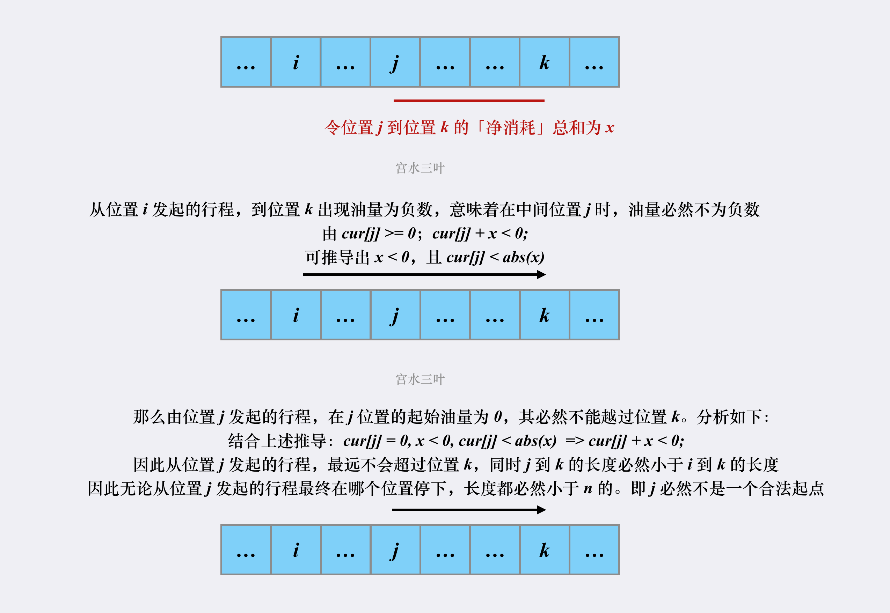

# 0. 贪心

## 0.1 贪心算法概述

贪心法用于求解最优化问题，即求解某一问题的最优解。 
 既然能用贪心法求解的问题是一个最优化问题，那么我们首先来了解下最优化问题的几个基本概念。

### 0.1.1 最优化问题的几个基本概念

-   目标函数 
     解决一个最优化问题，首先要将问题抽象成一个数学函数，这也就是一个数学建模的过程，这个能够描述问题的函数就称为『目标函数』，这个函数的最大/小值就是我们要求的最优值。

-   约束条件 
     任何函数都有它的取值范围，所有取值范围的集合就称为『约束条件』。

-   可行解 
     满足所有约束条件的解称为『可行解』。

-   最优解 
     满足约束条件，并且使得目标函数最大/小的解称为『最优解』。

-   贪心法的求解思路
    既然贪心法用于解决最优化问题，所以我们首先对问题进行数学建模，找出其中的：目标函数、约束条件。 

    最优化问题的结果需要用一个 n 元组来表示，如  $X=(x_1, x_2, x_3, …… ,x_n)$。 

    贪心法的执行一共需要 n 步，每一步都会确定 n 元组中的一个元素，并保证每一步选取的值都是局部最优的。在经过 n 步之后，一共选取了 n 个值，每个值都是局部最优的，最终我们就可以认为这 n 个局部最优的值是整体最优的。那么，在每一步中，究竟通过怎样的策略来选取一个当前局部最优解呢？这个选取策略就叫做『最优量度标准』（也叫做贪心准则）。最优量度标准选择的好坏，直接影响最终的结果是不是整体最优。而最优量度标准的选择往往是根据经验来确定的，也就是并不是所有的最优量度标准都能达到整体最优。所以你选取的那个最优量度标准能否导致整体最优，这是需要额外证明的。

    

### 0.1.2 贪心算法原型

```c++
SolutionType greedy(int[] a) {
    // 一开始结果集为空
    SolutionType solution = {};
    // 进行n步选值
    for ( int i=0; i<n; i++ ) {
        // 选出当前局部最优解x
        x = select(a);
        // 判断x是否满足约束条件，若不满足则继续选
        while( !isFeasible(x) ){
            x = select(a);
        }
        // 将当前最优解添加至结果集中
        solution.add(x);
    }
}
```


### 0.1.3 何时使用贪心法
满足如下条件，可以使用贪心法：

-   要求解的问题是一个最优化问题；

-   这个问题的解可以用n元组表示；

-   该问题满足最优子结构特性；

-   可以找到最优量度标准，并可以证明该最优量度标准能导致一个整体最优解；

    >    并非对所有最优化问题都能找到最优量度标准，若找不到可以使用动态规划法。


### 0.1.4 总结

贪心法用于求解最优化问题。采用多步决策的方式求解，每一步根据最优量度标准求出结果集的一个分量，保证该分量为当前的局部最优解。那么当进行n步决策后，就求出结果集的所有分量。只要最优量度标准选的合理，最终的结果就是一个最优解。 
当然，你选取的那个最优量度标准究竟能不能导致整体最优解，这是需要证明的。


## LC44 通配符匹配


```basic
// 我们用 sIndex 和 pIndex 表示当前遍历到 s 和 p 的位置
// 此时我们正在 s 中寻找某个 u_i
// 其在 s 和 p 中的起始位置为 sRecord 和 pRecord

// sIndex 和 sRecord 的初始值为 0
// 即我们从字符串 s 的首位开始匹配
sIndex = sRecord = 0

// pIndex 和 pRecord 的初始值为 1
// 这是因为模式 p 的首位是星号，那么 u_1 的起始位置为 1
pIndex = pRecord = 1

while sIndex < s.length and pIndex < p.length do
    if p[pIndex] == '*' then
        // 如果遇到星号，说明找到了 u_i，开始寻找 u_i+1
        pIndex += 1
        // 记录下起始位置
        sRecord = sIndex
        pRecord = pIndex
    else if match(s[sIndex], p[pIndex]) then
        // 如果两个字符可以匹配，就继续寻找 u_i 的下一个字符
        sIndex += 1
        pIndex += 1
    else if sRecord + 1 < s.length then
        // 如果两个字符不匹配，那么需要重新寻找 u_i
        // 枚举下一个 s 中的起始位置
        sRecord += 1
        sIndex = sRecord
        pIndex = pRecord
    else
        // 如果不匹配并且下一个起始位置不存在，那么匹配失败
        return False
    end if
end while

// 由于 p 的最后一个字符是星号，那么 s 未匹配完，那么没有关系
// 但如果 p 没有匹配完，那么 p 剩余的字符必须都是星号
return all(p[pIndex] ~ p[p.length - 1] == '*')
```


```go
func isMatch(s string, p string) bool {
    m, n := len(s), len(p)
    dp := make([][]bool, m + 1)
    for i := 0; i <= m; i++ {
        dp[i] = make([]bool, n + 1)
    }
    dp[0][0] = true
    for i := 1; i <= n; i++ {
        if p[i-1] == '*' {
            dp[0][i] = true
        } else {
            break
        }
    }
    for i := 1; i <= m; i++ {
        for j := 1; j <= n; j++ {
            if p[j-1] == '*' {
                dp[i][j] = dp[i][j-1] || dp[i-1][j]
            } else if p[j-1] == '?' || s[i-1] == p[j-1] {
                dp[i][j] = dp[i-1][j-1]
            }
        }
    }
    return dp[m][n]
}
```

## LC45 跳跃游戏2


```go
func jump(nums []int) int {
    length := len(nums)
    end := 0
    maxPosition := 0
    steps := 0
    for i := 0; i < length - 1; i++ {
        maxPosition = max(maxPosition, i + nums[i])
        if i == end {
            end = maxPosition
            steps++
        }
    }
    return steps
}

func max(x, y int) int {
    if x > y {
        return x
    }
    return y
}
```

## LC55 跳跃游戏


```c++
class Solution {
public:
    bool canJump(vector<int>& nums) {
        int n = nums.size();
        int rightmost = 0;
        for (int i = 0; i < n; ++i) {
            if (i <= rightmost) {
                rightmost = max(rightmost, i + nums[i]);
                if (rightmost >= n - 1) {
                    return true;
                }
            }
        }
        return false;
    }
};
```

## LC134 加油站


```c++
class Solution {
public:
    int canCompleteCircuit(vector<int>& gas, vector<int>& cost) {
        int curSum = 0;
        int totalSum = 0;
        int start = 0;
        for (int i = 0; i < gas.size(); i++) {
            curSum += gas[i] - cost[i];
            totalSum += gas[i] - cost[i];
            if (curSum < 0) {   // 当前累加rest[i]和 curSum一旦小于0
                start = i + 1;  // 起始位置更新为i+1
                curSum = 0;     // curSum从0开始
            }
        }
        if (totalSum < 0) return -1; // 说明怎么走都不可能跑一圈了
        return start;
    }
};
```





```java
class Solution {
    public int canCompleteCircuit(int[] gas, int[] cost) {
        int n = gas.length;
        for (int start = 0; start < n; ) {
            if (gas[start] < cost[start]) {
                start++;
            } else {
                int cur = gas[start] - cost[start];
                int idx = start + 1;
                while (idx % n != start) {
                    cur += gas[idx % n] - cost[idx % n];
                    if (cur < 0) break;
                    idx++;
                }
                if (idx % n == start) return start;
                else start = idx;
            }
        }
        return -1;
    }
}
```

## LC179 最大数


# 1.回溯

## 1.1 回溯算法概述

回溯算法是对树形或者图形结构执行一次深度优先遍历，实际上类似枚举的搜索尝试过程，在遍历的过程中寻找问题的解。

深度优先遍历有个特点：当发现已不满足求解条件时，就返回，尝试别的路径。此时对象类型变量就需要重置成为和之前一样，称为「状态重置」。

许多复杂的，规模较大的问题都可以使用回溯法，有「通用解题方法」的美称。实际上，回溯算法就是暴力搜索算法，它是早期的人工智能里使用的算法，借助计算机强大的计算能力帮助我们找到问题的解。

```python
result = []
def backtrack(路径, 选择列表):
    if 满足结束条件:
        result.add(路径)
        return

    for 选择 in 选择列表:
        做选择
        backtrack(路径, 选择列表)
        撤销选择
```

## LC22 括号生成


题解其实就一句话：有规律啊，剩余左括号总数要小于等于右括号。 递归把所有符合要求的加上去就行了。

```go
func generateParenthesis(n int) []string {
	if n == 0 {
		return []string{""}
	} else if n == 1 {
		return []string{"()"}
	} else {
		ret := make([]string, 0)
		tmp := make([]byte, 0)
		backtrack(n, n, &tmp, &ret)
		return ret
	}
}

func backtrack(l, r int, tmp *[]byte, ret *[]string) {
	if l == 0 && r == 0 {
		(*ret) = append((*ret), string(*tmp))
		return
	}
	if l < r {
		(*tmp) = append((*tmp), ')')
		backtrack(l, r-1, tmp, ret)
		(*tmp) = (*tmp)[:len(*tmp)-1]
	}
	if l > 0 {
		(*tmp) = append((*tmp), '(')
		backtrack(l-1, r, tmp, ret)
		(*tmp) = (*tmp)[:len(*tmp)-1]
	}
}
```

## LC39 组合总和


```go
func combinationSum(candidates []int, target int) [][]int {
	path := make([]int, 0)
	ret := make([][]int, 0)
	sort.Ints(candidates)
	backtrack(0, target, &path, &ret, &candidates)
	return ret
}

func backtrack(idx, target int, path *[]int, ret *[][]int, candidates *[]int) {
	if target == 0 {
		dummy := make([]int, len(*path))
		for i, val := range *path {
			dummy[i] = val
		}
		(*ret) = append((*ret), dummy)
		return
	}
	if idx == len(*candidates) {
		// 凑不出 target 了
		return
	}
	for i := idx; i < len(*candidates); i++ {
		if (*candidates)[i] <= target {
			(*path) = append((*path), (*candidates)[i])
			backtrack(i, target-(*candidates)[i], path, ret, candidates)
			(*path) = (*path)[:len(*path)-1]
		} else {
			break
		}
	}
}
```

## LC40 组合总和2


```c++
class Solution {
private:
    vector<pair<int, int>> freq;
    vector<vector<int>> ans;
    vector<int> sequence;

public:
    void dfs(int pos, int rest) {
        if (rest == 0) {
            ans.push_back(sequence);
            return;
        }
        if (pos == freq.size() || rest < freq[pos].first) {
            return;
        }

        dfs(pos + 1, rest);

        int most = min(rest / freq[pos].first, freq[pos].second);
        for (int i = 1; i <= most; ++i) {
            sequence.push_back(freq[pos].first);
            dfs(pos + 1, rest - i * freq[pos].first);
        }
        for (int i = 1; i <= most; ++i) {
            sequence.pop_back();
        }
    }

    vector<vector<int>> combinationSum2(vector<int>& candidates, int target) {
        sort(candidates.begin(), candidates.end());
        for (int num: candidates) {
            if (freq.empty() || num != freq.back().first) {
                freq.emplace_back(num, 1);
            } else {
                ++freq.back().second;
            }
        }
        dfs(0, target);
        return ans;
    }
};
```

>   其实在 LC 39的代码里加一句判断即可

```go
func combinationSum2(candidates []int, target int) [][]int {
	path := make([]int, 0)
	ret := make([][]int, 0)
	sort.Ints(candidates)
	backtrack(0, target, &path, &ret, &candidates)
	return ret
}

func backtrack(idx, target int, path *[]int, ret *[][]int, candidates *[]int) {
	if target == 0 {
		dummy := make([]int, len(*path))
		copy(dummy, (*path))
		(*ret) = append(*ret, dummy)
	}
	if idx == len(*candidates) {
		return
	}
	for i := idx; i < len(*candidates); i++ {
		if i > idx && (*candidates)[i] == (*candidates)[i-1] {
			continue
		}
		if (*candidates)[i] <= target {
			(*path) = append((*path), (*candidates)[i])
			backtrack(i+1, target-(*candidates)[i], path, ret, candidates)
			(*path) = (*path)[:len(*path)-1]
		} else {
			break
		}
	}
}
```

## LC46 全排列


```go
func permute(nums []int) [][]int {
	path := make([]int, 0)
	ret := make([][]int, 0)
	backtrack(&nums, &path, &ret)
	return ret
}

// 实际上可以不用 visit 数组
func backtrack(nums *[]int, path *[]int, ret *[][]int) {
	if len(*path) == len(*nums) {
		dummy := make([]int, len(*path))
		copy(dummy, (*path))
		(*ret) = append((*ret), dummy)
		return
	} else {
		for _, num := range *nums {
			i := 0
			for ; i < len(*path); i++ {
				if num == (*path)[i] {
					break
				}
			}
			if i != len(*path) {
				continue
			} else {
				(*path) = append((*path), num)
				backtrack(nums, path, ret)
				(*path) = (*path)[:len(*path)-1]
			}
		}
	}
}
```

## LC47 全排列2


```go
func permuteUnique(nums []int) [][]int {
	sort.Ints(nums)
	path := make([]int, 0)
	ret := make([][]int, 0)
	visit := make([]int, len(nums))
	backtrack(0, &nums, &path, &visit, &ret)
	return ret
}

// 这次用 visit 比较省事
func backtrack(idx int, nums, path, visit *[]int, ret *[][]int) {
	if idx == len(*nums) {
		dummy := make([]int, len(*path))
		copy(dummy, *path)
		(*ret) = append((*ret), dummy)
		return
	}
	for i := 0; i < len(*nums); i++ {
		if (*visit)[i] == 1 || (i > 0 && (*nums)[i] == (*nums)[i-1] && (*visit)[i-1] == 0) {
			continue
		}
		(*path) = append((*path), (*nums)[i])
		(*visit)[i] = 1
		backtrack(idx+1, nums, path, visit, ret)
		(*visit)[i] = 0
		(*path) = (*path)[:len(*path)-1]
	}
}
```

## LC77 组合


```java
import java.util.ArrayDeque;
import java.util.ArrayList;
import java.util.Deque;
import java.util.List;

public class Solution {

    public List<List<Integer>> combine(int n, int k) {
        List<List<Integer>> res = new ArrayList<>();
        if (k <= 0 || n < k) {
            return res;
        }
        Deque<Integer> path = new ArrayDeque<>();
        dfs(n, k, 1, path, res);
        return res;
    }

    private void dfs(int n, int k, int index, Deque<Integer> path, List<List<Integer>> res) {
        if (path.size() == k) {
            res.add(new ArrayList<>(path));
            return;
        }

        // 只有这里 i <= n - (k - path.size()) + 1 与参考代码 1 不同
        for (int i = index; i <= n - (k - path.size()) + 1; i++) {
            path.addLast(i);
            dfs(n, k, i + 1, path, res);
            path.removeLast();
        }
    }
}
```

## LC78 子集


>   其实幂集用掩码就完事儿了

```rust
impl Solution {
    pub fn subsets(nums: Vec<i32>) -> Vec<Vec<i32>> {
        (0..1<<nums.len()).map(|mask| {
            nums.iter()
                .enumerate()
                .filter_map(|(i, &num)| {
                    if (mask & 1<<i) != 0 {Some(num)} else {None}
                })
                .collect()
        })
        .collect()
    }
}
```

## LC79 单词搜索


>   基础的回溯，无需题解

```go
func exist(board [][]byte, word string) bool {
	visited := make([][]bool, len(board))
	for i := range board {
		visited[i] = make([]bool, len(board[i]))
	}
	for i := 0; i < len(board); i++ {
		for j := 0; j < len(board[0]); j++ {
			if backtrack(&board, &visited, i, j, 0, word) {
				return true
			}
		}
	}
	return false
}

func backtrack(board *[][]byte, visited *[][]bool, i, j, k int, word string) bool {
	if (*board)[i][j] != word[k] {
		return false
	}
    if k == len(word) - 1 {
		return true
	}
	(*visited)[i][j] = true
	directions := [][]int{{1, 0}, {-1, 0}, {0, 1}, {0, -1}}
	for _, direction := range directions {
		ni, nj := i+direction[0], j+direction[1]
		if ni >= 0 && ni < len(*board) && nj >= 0 && nj < len((*board)[0]) {
			if !(*visited)[ni][nj] {
				if backtrack(board, visited, ni, nj, k+1, word) {
                    (*visited)[i][j] = false
					return true
				}
			}
		}
	}
	(*visited)[i][j] = false
	return false
}
```

## LC90 子集2


在递归时，若发现没有选择上一个数，且当前数字与上一个数相同，则可以跳过当前生成的子集。

```go
func subsetsWithDup(nums []int) [][]int {
	path := make([]int, 0)
	ret := make([][]int, 0)
	sort.Ints(nums)
	backtrack(&nums, &path, &ret, 0)
	return ret
}

func backtrack(nums, path *[]int, ret *[][]int, idx int) {
	if idx == len((*nums)) {
		dummy := make([]int, len((*path)))
		copy(dummy, (*path))
		(*ret) = append((*ret), dummy)
		return
	}
	(*path) = append((*path), (*nums)[idx])
	backtrack(nums, path, ret, idx+1)
	(*path) = (*path)[:len((*path))-1]
	for idx < len((*nums))-1 && (*nums)[idx] == (*nums)[idx+1] {
		idx++
	}
	backtrack(nums, path, ret, idx+1)
}
```

## LC93 复原IP地址


```go
func restoreIpAddresses(s string) []string {
	segs := make([]int, 4)
	ret := make([]string, 0)
	backtrack(0, 0, s, &ret, &segs)
	return ret
}

func backtrack(seg, idx int, s string, ret *[]string, segs *[]int) {
	if seg == 4 {
		if idx == len(s) {
			str := ""
			for i := 0; i < 4; i++ {
				str += strconv.Itoa((*segs)[i])
				if i != 3 {
					str += "."
				}
			}
			(*ret) = append((*ret), str)
		}
		return
	}
	if idx == len(s) {
		return
	}
	// 特判前导0
	if s[idx] == '0' {
		(*segs)[seg] = 0
		backtrack(seg+1, idx+1, s, ret, segs)
	}

	addr := 0
	for i := idx; i < len(s); i++ {
		addr = addr*10 + int(s[i]-'0')
		if addr > 0 && addr < 256 {
			(*segs)[seg] = addr
			backtrack(seg+1, i+1, s, ret, segs)
		} else {
			break
		}
	}
}
```

## LC95  不同的二叉搜索树2


```go
func generateTrees(n int) []*TreeNode {
	if n == 0 {
		return nil
	} else {
		return backtrack(1, n)
	}
}

func backtrack(start, end int) []*TreeNode {
	if start > end {
		return []*TreeNode{nil}
	}
	trees := make([]*TreeNode, 0)
	for i := start; i <= end; i++ {
		left := backtrack(start, i-1)
		right := backtrack(i+1, end)
		for _, l := range left {
			for _, r := range right {
				curr := &TreeNode{i, nil, nil}
				curr.Left = l
				curr.Right = r
				trees = append(trees, curr)
			}
		}
	}
	return trees
}
```

## LC113 路径总和2


>   标准的 dfs，也可以理解为回溯

```go
func pathSum(root *TreeNode, targetSum int) [][]int {
	path := make([]int, 0)
	ret := make([][]int, 0)
	backtrack(root, &path, &ret, targetSum)
	return ret
}

func backtrack(root *TreeNode, path *[]int, ret *[][]int, target int) {
	if root == nil {
		return
	}
	(*path) = append((*path), root.Val)
	if target-root.Val == 0 && root.Left == nil && root.Right == nil {
		dummy := make([]int, len((*path)))
		copy(dummy, (*path))
		(*ret) = append((*ret), dummy)
	}
	backtrack(root.Left, path, ret, target-root.Val)
	backtrack(root.Right, path, ret, target-root.Val)
	(*path) = (*path)[:len((*path))-1]
}
```

## LC797 所有可能的路径


```c++
template <typename HOFunctor>
class YCombinator
{
    HOFunctor func;

public:
    template <typename Function>
    YCombinator(Function &&func) : func((Function &&) func) {}

    template <typename... Args>
    auto operator()(Args &&...args) -> decltype(func(*this, (Args &&) args...))
    {
        return func(*this, (Args &&) args...);
    }
};

// template <typename Functor>
// YCombinator(Functor) -> YCombinator<Functor>;

template <typename Function>
YCombinator<Function> make_YCombinator(Function &&func) { return YCombinator<Function>(func); }

class Solution
{
public:
    std::vector<std::vector<int>> allPathsSourceTarget(std::vector<std::vector<int>> &graph)
    {
        std::vector<std::vector<int>> ans;
        std::vector<int> path({0});

        auto dfs = make_YCombinator(
            [&](auto &&self, int x) -> void
            {
                if (x == n)
                {
                    ans.push_back(path);
                    return;
                }
                for (auto &y : graph[x])
                {
                    path.push_back(y);
                    self(y);
                    path.pop_back();
                }
            });
        dfs(0);
        return ans;
    }
};
```

# 2. 图

 ## 2.1 常用图算法与数据结构概述

### 2.1.1 前向星


```bash
针对上图，假设我们输入边的顺序为:
1 2
2 3
3 4
1 3
4 1
1 5
4 5
那么依据上述规则排完序后就得到:

编号:     1   2   3   4   5   6   7

起点u:    1   1   1   2   3   4   4

终点v:    2   3   5   3   4   1   5
最终得到head[i]、len[i]值如下：

head[1] = 1     len[1] = 3

head[2] = 4     len[2] = 1

head[3] = 5     len[3] = 1

head[4] = 6     len[4] = 2
```


```c++
我们建立边结构体为:

struct Edge

{
     int next;
     int to;
     int w;
};
其中：
edge[i].to表示第i条边的终点,
edge[i].next表示与第i条边同起点的下一条边的存储位置,
edge[i].w为边权值.
```


```c++
void add_edge(int u, int v, int w){ //加边函数。u为起点，v为终点，w为边权

    edge[cnt].to=v; //终点

    edge[cnt].w=w; //权值

    edge[cnt].next=head[u]; //以u为起点的的最后一条边的编号

    head[u]=cnt++; //更新以u为起点的上一条边的编号

}
```

```c++
给你一组数据：
第一行表示 5 个顶点 7 条边
接下来是7条边的起点、终点和权值

5 7
1 2 1
2 3 2
3 4 3
1 3 4
4 1 5
1 5 6
4 5 7
```


```c++
依据next，head数组的约定，并按边的输入顺序从0开始对边进行编号，
然后按照上面的数据就可以写出下面的过程：

对于1 2 1这条边：edge[0].to=2;   edge[0].next=-1;    head[1]=0;

对于2 3 2这条边：edge[1].to=3;   edge[1].next=-1;    head[2]=1;

对于3 4 3这条边：edge[2].to=4;   edge[2],next=-1;    head[3]=2;

对于1 3 4这条边：edge[3].to=3;   edge[3].next= 0;    head[1]=3;

对于4 1 5这条边：edge[4].to=1;   edge[4].next=-1;    head[4]=4;

对于1 5 6这条边：edge[5].to=5;   edge[5].next= 3;    head[1]=5;

对于4 5 7这条边：edge[6].to=5;   edge[6].next= 4;    head[4]=6;

很明显,head[i]保存的是以i为起点的所有边中编号最大的那个,而把这个当作顶点i的第一条起始边的位置.
```

```c++
遍历函数如下：
for(int i=1; i<=n; i++){ //n个起点    
        cout<<i<<endl;
        for(int j=head[i]; j!=-1; j=edge[j].next) //遍历以i为起点的所有边        
            cout<<i<<" "<<edge[j].to<<" "<<edge[j].w<<endl;
        cout<<endl;
    }

第一层for循环：依次遍历以1...n为起点的边的集合。
第二层for循环：遍历以i为起点的所有边，j首先等于head[i]。
注意：head[i]表示与点i起点相同的最后一条边的编号。
然后，通过edge[j].next来找与边j起点相同的上一条边的编号，终止条件为edge[j].next=-1。
```

### 2.1.2 图搜索算法

-   深度优先搜索

-   广度优先搜索

-   贪婪最佳优先算法

    

    

    

-   Dijkstra 算法

    

    

    

-   A* 算法

    

-   Bellman-Ford 算法

    

-   SPFA 算法

    

### 2.1.3 图排序算法

-   拓扑排序

    

-   

## LC207 课程表


这是一道经典的拓扑排序

```go
func canFinish(numCourses int, prerequisites [][]int) bool {
	degree := make([]int, numCourses)
	edges := make([][]int, numCourses)
	for i := range edges {
		edges[i] = []int{}
	}
	for _, prerequisite := range prerequisites {
		edges[prerequisite[1]] = append(edges[prerequisite[1]], prerequisite[0])
		degree[prerequisite[0]]++
	}
	queue := make([]int, 0)
	for i := 0; i < numCourses; i++ {
		if degree[i] == 0 {
			queue = append(queue, i)
		}
	}
	for len(queue) != 0 {
		cur := queue[0]
		queue = queue[1:]
		for _, v := range edges[cur] {
			degree[v]--
			if degree[v] == 0 {
				queue = append(queue, v)
			}
		}
	}
	for _, v := range degree {
		if v != 0 {
			return false
		}
	}
	return true
}
```


# 3 线段树

## 3.1 线段树概述


```C++
void build(int s, int t, int p) {
  // 对 [s,t] 区间建立线段树,当前根的编号为 p
  if (s == t) {
    d[p] = a[s];
    return;
  }
  int m = s + ((t - s) >> 1);
  // 移位运算符的优先级小于加减法，所以加上括号
  // 如果写成 (s + t) >> 1 可能会时间超限
  build(s, m, p * 2), build(m + 1, t, p * 2 + 1);
  // 递归对左右区间建树
  d[p] = d[p * 2] + d[(p * 2) + 1];
}
```


```c++
int getsum(int l, int r, int s, int t, int p) {
  // [l,r] 为查询区间,[s,t] 为当前节点包含的区间,p 为当前节点的编号
  if (l <= s && t <= r)
    return d[p];  // 当前区间为询问区间的子集时直接返回当前区间的和
  int m = s + ((t - s) >> 1), sum = 0;
  if (l <= m) sum += getsum(l, r, s, m, p * 2);
  // 如果左儿子代表的区间 [l,m] 与询问区间有交集,则递归查询左儿子
  if (r > m) sum += getsum(l, r, m + 1, t, p * 2 + 1);
  // 如果右儿子代表的区间 [m+1,r] 与询问区间有交集,则递归查询右儿子
  return sum;
}
```


```c++
// 区间修改（区间加上某个值）
void update(int l, int r, int c, int s, int t, int p) {
  // [l,r] 为修改区间,c 为被修改的元素的变化量,[s,t] 为当前节点包含的区间,p
  // 为当前节点的编号
  if (l <= s && t <= r) {
    d[p] += (t - s + 1) * c, b[p] += c;
    return;
  }  // 当前区间为修改区间的子集时直接修改当前节点的值,然后打标记,结束修改
  int m = s + ((t - s) >> 1);
  if (b[p] && s != t) {
    // 如果当前节点的懒标记非空,则更新当前节点两个子节点的值和懒标记值
    d[p * 2] += b[p] * (m - s + 1), d[p * 2 + 1] += b[p] * (t - m);
    b[p * 2] += b[p], b[p * 2 + 1] += b[p];  // 将标记下传给子节点
    b[p] = 0;                                // 清空当前节点的标记
  }
  if (l <= m) update(l, r, c, s, m, p * 2);
  if (r > m) update(l, r, c, m + 1, t, p * 2 + 1);
  d[p] = d[p * 2] + d[p * 2 + 1];
}
```

```C++
// 区间查询（区间求和）
int getsum(int l, int r, int s, int t, int p) {
  // [l,r] 为查询区间,[s,t] 为当前节点包含的区间,p为当前节点的编号
  if (l <= s && t <= r) return d[p];
  // 当前区间为询问区间的子集时直接返回当前区间的和
  int m = s + ((t - s) >> 1);
  if (b[p]) {
    // 如果当前节点的懒标记非空,则更新当前节点两个子节点的值和懒标记值
    d[p * 2] += b[p] * (m - s + 1), d[p * 2 + 1] += b[p] * (t - m),
        b[p * 2] += b[p], b[p * 2 + 1] += b[p];  // 将标记下传给子节点
    b[p] = 0;                                    // 清空当前节点的标记
  }
  int sum = 0;
  if (l <= m) sum = getsum(l, r, s, m, p * 2);
  if (r > m) sum += getsum(l, r, m + 1, t, p * 2 + 1);
  return sum;
}
```

```c++
// 如果你是要实现区间修改为某一个值而不是加上某一个值的话，代码如下
void update(int l, int r, int c, int s, int t, int p) {
  if (l <= s && t <= r) {
    d[p] = (t - s + 1) * c, b[p] = c;
    return;
  }
  int m = s + ((t - s) >> 1);
  if (b[p]) {
    d[p * 2] = b[p] * (m - s + 1), d[p * 2 + 1] = b[p] * (t - m),
          b[p * 2] = b[p * 2 + 1] = b[p];
    b[p] = 0;
  }
  if (l <= m) update(l, r, c, s, m, p * 2);
  if (r > m) update(l, r, c, m + 1, t, p * 2 + 1);
  d[p] = d[p * 2] + d[p * 2 + 1];
}
int getsum(int l, int r, int s, int t, int p) {
  if (l <= s && t <= r) return d[p];
  int m = s + ((t - s) >> 1);
  if (b[p]) {
    d[p * 2] = b[p] * (m - s + 1), d[p * 2 + 1] = b[p] * (t - m),
          b[p * 2] = b[p * 2 + 1] = b[p];
    b[p] = 0;
  }
  int sum = 0;
  if (l <= m) sum = getsum(l, r, s, m, p * 2);
  if (r > m) sum += getsum(l, r, m + 1, t, p * 2 + 1);
  return sum;
}
```

## 3.2 线段树实现

二叉树的节点区间定义，`[start, end]`代表节点的区间范围，`max` 是节点在`[start, end]`区间上的最大值 `left` , `right` 是当前节点区间划分之后的左右节点区间：

```java
// 节点区间定义
// [start, end] 代表节点的区间范围
// max 是节点在(start,end)区间上的最大值
// left , right 是当前节点区间划分之后的左右节点区间
public class SegmentTreeNode {
    public int start, end, max;
    public SegmentTreeNode left, right;
    public SegmentTreeNode(int start, int end, int max) {
        this.start = start;
        this.end = end;
        this.max = max
        this.left = this.right = null;
    }
}
```

给定一个区间，我们要维护线段树中存在的区间中最大的值。这将有利于我们高效的查询任何区间的最大值。给出`A`数组，基于`A`数组构建一棵维护最大值的线段树，我们可以在`O(logN)`的复杂度内查询任意区间的最大值：

比如原数组 `A = [1, 4, 2, 3]`

```java
// 构造的代码及注释
public SegmentTreeNode build(int[] A) {
    // write your code here
    return buildhelper(0, A.length - 1, A);
}
public SegmentTreeNode buildhelper(int left, int right, int[] A){
    if(left > right){
        return null;
    }
    SegmentTreeNode root = new SegmentTreeNode(left, right, A[left]); // 根据节点区间的左边界的序列值为节点赋初值
    if(left == right){
        return root; // 如果左边界和右边界相等,节点左边界的序列值就是线段树节点的接节点值
    }
    int mid = (left + right) / 2; // 划分当前区间的左右区间
    root.left = buildhelper(left, mid, A);
    root.right = buildhelper(mid + 1, right, A);
    root.max = Math.max(root.left.max, root.right.max); // 根据节点区间的左右区间的节点值得到当前节点的节点值
    return root;
}
```

**举一反三：**
 如果需要区间的最小值:
 `root.min = Math.min(root.left.min, root.right.min);`
 如果需要区间的和:
 `root.sum = root.left.sum + root.right.sum;`

更新序列中的一个节点，如何把这种变化体现到线段树中去? 更新所以需要从叶子节点一路走到根节点, 去更新线段树上的值。因为线段树的高度为`log(n)`,所以更新序列中一个节点的复杂度为`log(n)`。

```java
// 单点更新的代码及注释
public void modify(SegmentTreeNode root, int index, int value) {
    // write your code here
    if(root.start == root.end && root.start == index) { // 找到被改动的叶子节点
        root.max = value; // 改变value值
        return ;
    }
    int mid = (root.start + root.end) / 2; // 将当前节点区间分割为2个区间的分割线
    if(index <= mid){ // 如果index在当前节点的左边
        modify(root.left, index, value); // 递归操作
        root.max = Math.max(root.right.max, root.left.max); // 可能对当前节点的影响
    }
    else {            // 如果index在当前节点的右边
        modify(root.right, index, value); // 递归操作
        root.max = Math.max(root.left.max, root.right.max); // 可能对当前节点的影响
    }
    return ;
}
```

线段树的区间查询操作就是将当前区间分解为较小的子区间,然后由子区间的最大值就可以快速得到需要查询区间的最大值。任意长度的线段，最多被拆分成$log(n)$​条线段树上存在的线段，所以查询的时间复杂度为`O(log(n))`。

```java
// 区间查询的代码及注释
public int query(TreeNode root, int start, int end) {
    if (start <= root.start && root.end <= end) {
        // 如果查询区间在当前节点的区间之内,直接输出结果
        return root.max;
    }
    int mid = (root.start + root.end) / 2; // 将当前节点区间分割为左右2个区间的分割线
    int ans = Integer.MIN_VALUE; // 给结果赋初值
    if (mid >= start) {   // 如果查询区间和左边节点区间有交集,则寻找查询区间在左边区间上的最大值
        ans = Math.max(ans, query(root.left, start, end));
    }
    if (mid + 1 <= end) { // 如果查询区间和右边节点区间有交集,则寻找查询区间在右边区间上的最大值
        ans = Math.max(ans, query(root.right, start, end));
    }
    return ans; // 返回查询结果
}
```

虽然 Segment Tree 线段树逻辑上是一棵二叉树，**但是实际存储时可以通过数组来实现，**通过父子节点的下标的数值关系可以访问父节点的子节点。

例如通过如下代码将一个数组转换为一个 Segment Tree：

```java
    // a segment tree
    private int[] seg;
    
    // the element count
    private int n;
    
    public NumArray(int[] nums) {
        n = nums.length;
 
        if(n > 0) {
            seg = new int[4 * n];
        
            build(nums, 0, n - 1, 0);
        }
    }
    
    // build segment tree, set the value of seg[idx]
    public void build(int[] nums, int start, int end, int idx) {
        if(start == end) {
            seg[idx] = nums[start];
        }
        else {
            int mid = (start + end) / 2;
            
            // build left tree
            build(nums, start, mid, 2 * idx + 1);
            
            // build right tree
            build(nums, mid + 1, end, 2 * idx + 2);
            
            seg[idx] = seg[2 * idx + 1] + seg[2 * idx + 2];
        }
    }
```

**更新元素：**更新元素需要更新两个地方，一是原数组对应的下标的值，另外一个是包含了这个元素的 Segment Tree 中的节点的值。具体也是通过递归实现：

```java
    public void update(int i, int val) {
        update(0, n - 1, i, val, 0);
    }
    
    public void update(int start, int end, int i, int val, int idx) {
        // leaf node. update element.
        if (start == end) {
            seg[idx] = val;
            return;
        }
        
        int mid = (start + end) / 2;
        
        // left tree
        if (i <= mid) {
            update(start, mid, i, val, 2 * idx + 1);
        }
        // right tree
        else {
            update(mid + 1, end, i, val, 2 * idx + 2);
        }
        
        seg[idx] = seg[2 * idx + 1] + seg[2 * idx + 2];
    }
```

**区间求和：**区间求和也是通过递归实现，关键在于根据当前节点表示的范围以及需要求的区间的范围的关系进行求和：

```java
    public int sumRange(int i, int j) {
        return sumRange(0, n - 1, i, j, 0);
    }
    
    public int sumRange(int start, int end, int i, int j, int idx) {
        // segment completely outside range, represents a null node
        if (start > j || end < i)
            return 0;
        
        // segment completely inside range
        if (i <= start && j >= end)
            return seg[idx];
        
        int mid = (start + end) / 2;
        
        return sumRange(start, mid, i, j, 2 * idx + 1) +
            sumRange(mid + 1, end, i, j, 2 * idx + 2);
    }
```

## LiC201 线段树的构造


```c++
// 树状的线段树实现
class SegmentTreeNode
{
public:
    int start, end;
    SegmentTreeNode *left, *right;
    SegmentTreeNode(int start, int end)
    {
        this->start = start, this->end = end;
        this->left = this->right = nullptr;
    }
};

class Solution
{
public:
    /**
     * @param start: start value.
     * @param end: end value.
     * @return: The root of Segment Tree.
     */
    SegmentTreeNode *build(int start, int end)
    {
        // write your code here
        if (start > end)
        {
            return nullptr;
        }
        SegmentTreeNode* root = new SegmentTreeNode(start, end);
        if (start != end)
        {
            int mid = (start + end) >> 1;
            root->left = build(start, mid);
            root->right = build(mid + 1, end);
        } 
        return root;
    }
};
```

## LiC202 线段树的查询


```c++
class SegmentTreeNode
{
public:
    int start, end, max;
    SegmentTreeNode *left, *right;
    SegmentTreeNode(int start, int end, int max)
    {
        this->start = start, this->end = end;
        this->left = this->right = nullptr;
        this->max = max;
    }
};

class Solution
{
public:
    /**
     * @param root: The root of segment tree.
     * @param start: start value.
     * @param end: end value.
     * @return: The maximum number in the interval [start, end]
     */
    int query(SegmentTreeNode *root, int start, int end)
    {
        // write your code here
        if (root->end < start || root->start > end)
        {
            return INT32_MIN;
        }
        if (root->start >= start && root->end <= end)
        {
            return root->max;
        }
        return std::max(query(root->left, start, end), query(root->right, start, end));
    }
};
```

## LiC203 线段树的修改


```c++
class SegmentTreeNode
{
public:
    int start, end, max;
    SegmentTreeNode *left, *right;
    SegmentTreeNode(int start, int end, int max)
    {
        this->start = start, this->end = end;
        this->left = this->right = nullptr;
        this->max = max;
    }
};

class Solution {
public:
    /**
     * @param root: The root of segment tree.
     * @param index: index.
     * @param value: value
     * @return: nothing
     */
    void modify(SegmentTreeNode * root, int index, int value) {
        // write your code here
        if (root == nullptr)
        {
            return;
        }
        // 是叶子节点，修改值
        if (root->start == root->end)
        {
            root->max = value;
            return;
        }
        // 在左侧
        if (index <= root->left->end)
        {
            modify(root->left, index, value);
        }
        // 在右侧
        else
        {
            modify(root->right, index, value);
        }

        root->max = std::max(root->left->max, root->right->max);
    }
};
```

## LiC247 线段树的查询2


```c++
class SegmentTreeNode
{
public:
    int start, end, count;
    SegmentTreeNode *left, *right;
    SegmentTreeNode(int start, int end, int count)
    {
        this->start = start;
        this->end = end;
        this->count = count;
        this->left = this->right = nullptr;
    }
};

class Solution
{
public:
    /*
     * @param root: The root of segment tree.
     * @param start: start value.
     * @param end: end value.
     * @return: The count number in the interval [start, end]
     */
    int query(SegmentTreeNode *root, int start, int end)
    {
        // write your code here
        if (root == nullptr)
        {
            return 0;
        }
        // 越界
        if (root->end < start || root->start > end)
        {
            return 0;
        } 
        // 查询到子区间
        // 画个图就能明白，因为越接近根的区间越大，所以一定是先覆盖能覆盖的最大子区间，保证了完全覆盖
        if (root->start >= start && root->end <= end)
        {
            return root->count;
        }
        return query(root->left, start, end) + query(root->right, start, end);
    }
};
```

## LiC439 线段树的构造2


```c++
class SegmentTreeNode
{
public:
    int start, end, max;
    SegmentTreeNode *left, *right;
    SegmentTreeNode(int start, int end, int max)
    {
        this->start = start;
        this->end = end;
        this->max = max;
        this->left = this->right = NULL;
    }
};

class Solution
{
public:
    /**
     * @param A: a list of integer
     * @return: The root of Segment Tree
     */
    SegmentTreeNode *build(std::vector<int> &A)
    {
        // write your code here
        return buildhelper(0, A.size() - 1, A);
    }

    /**
     * @param start: start index
     * @param end: end index
     * @param A: a list of integer
     * @return: SegmentTreeNode* The root of Segment Tree
     */
    SegmentTreeNode *buildhelper(int start, int end, std::vector<int> &A)
    {
        if (start > end)
        {
            return nullptr;
        }
        SegmentTreeNode *root = new SegmentTreeNode(start, end, INT_MIN);
        if (start == end)
        {
            root->max = A[start];
        }
        else
        {
            int mid = (start + end) >> 1;
            root->left = buildhelper(start, mid, A);
            root->right = buildhelper(mid + 1, end, A);
            // 如果是求和型，这里换成加号就完事了！
            root->max = std::max(root->left->max, root->right->max);
        }
        return root;
    }
};
```

## LiC205 区间最小数


```c++
// 树实现
class Interval
{
public:
    int start, end;
    Interval(int start, int end)
    {
        this->start = start;
        this->end = end;
    }
};

struct SegmentTreeNode
{
    int start, end, min;
    SegmentTreeNode *left, *right;
    SegmentTreeNode(int start, int end, int min) : start(start), end(end), min(min) {}
};

class SegmentTree
{
public:
    SegmentTree(const std::vector<int> &A)
    {
        this->tree = buildhelper(0, A.size() - 1, A);
    }

    int query(const Interval& interval)
    {
        return queryhelper(this->tree, interval);
    }

private:
    SegmentTreeNode *tree;

    SegmentTreeNode *buildhelper(int start, int end, const std::vector<int> &A)
    {
        if (start > end)
        {
            return nullptr;
        }
        SegmentTreeNode *root = new SegmentTreeNode(start, end, INT_MAX);
        if (start == end)
        {
            root->min = A[start];
        }
        else
        {
            int mid = (start + end) >> 1;
            root->left = buildhelper(start, mid, A);
            root->right = buildhelper(mid + 1, end, A);
            root->min = std::min(root->left->min, root->right->min);
        }
        return root;
    }

    static int queryhelper(SegmentTreeNode *root, const Interval& interval)
    {
        if (root->end < interval.start || root->start > interval.end)
        {
            return INT_MAX;
        }
        if (root->start >= interval.start && root->end <= interval.end)
        {
            return root->min;
        }
        return std::min(queryhelper(root->left, interval), queryhelper(root->right, interval));
    }
};

class Solution
{
public:
    /**
     * @param A: An integer array
     * @param queries: An query list
     * @return: The result list
     */
    std::vector<int> intervalMinNumber(std::vector<int> &A, std::vector<Interval> &queries)
    {
        // write your code here
        std::vector<int> ret;
        SegmentTree tree(A);
        for(auto& interval : queries)
        {
            ret.push_back(tree.query(interval));
        }
        return ret;
    }
};
```

## LiC207 区间求和2


```c++
struct SegmentTreeNode2
{
    int start, end;
    int64_t sum;
    SegmentTreeNode2 *left, *right;
    SegmentTreeNode2(int start, int end, int min) : start(start), end(end), min(min) {}
};

class SegmentTree
{
public:
    SegmentTree(const std::vector<int> &A)
    {
        tree = buildhelper(0, A.size() - 1, A);
    }

    int64_t query(int start, int end)
    {
        return SegmentTree::queryhelper(this->tree, start, end);
    }

    void modify(int index, int value)
    {
        return SegmentTree::modifyhelper(this->tree, index, value);
    }

private:
    SegmentTreeNode2 *tree;

    SegmentTreeNode2 *buildhelper(int start, int end, const std::vector<int> &A)
    {
        if (start > end)
        {
            return nullptr;
        }
        SegmentTreeNode2 *root = new SegmentTreeNode2(start, end, INT_MAX);
        if (start == end)
        {
            root->sum = (int64_t)A[start];
        }
        else
        {
            int mid = (start + end) >> 1;
            root->left = buildhelper(start, mid, A);
            root->right = buildhelper(mid + 1, end, A);
            root->sum = root->left->sum + root->right->sum;
        }
        return root;
    }

    static void modifyhelper(SegmentTreeNode2 *root, int index, int value)
    {
        // write your code here
        if (root == nullptr)
        {
            return;
        }
        // 是叶子节点，修改值
        if (root->start == root->end)
        {
            root->sum = value;
            return;
        }
        // 在左侧
        if (index <= root->left->end)
        {
            SegmentTree::modifyhelper(root->left, index, value);
        }
        // 在右侧
        else
        {
            SegmentTree::modifyhelper(root->right, index, value);
        }

        root->sum = root->left->sum + root->right->sum;
    }

    static int64_t queryhelper(SegmentTreeNode2 *root, int start, int end)
    {
        if (root == nullptr)
        {
            return 0;
        }
        // 越界
        if (root->end < start || root->start > end)
        {
            return 0;
        } 
        // 查询到子区间
        // 画个图就能明白，因为越接近根的区间越大，所以一定是先覆盖能覆盖的最大子区间，保证了完全覆盖
        if (root->start >= start && root->end <= end)
        {
            return root->sum;
        }
        return SegmentTree::queryhelper(root->left, start, end) + SegmentTree::queryhelper(root->right, start, end);
    }
};

class Solution
{
public:
    /* you may need to use some attributes here */
    SegmentTree *tree;

    /**
    * @param A: An integer array
    */
    Solution(std::vector<int> A)
    {
        // do intialization if necessary
        tree = new SegmentTree(A);
    }

    /**
     * @param start: An integer
     * @param end: An integer
     * @return: The sum from start to end
     */
    int64_t query(int start, int end)
    {
        // write your code here
        tree->query(start, end);
    }

    /**
     * @param index: An integer
     * @param value: An integer
     * @return: nothing
     */
    void modify(int index, int value)
    {
        // write your code here
        tree->modify(index, value);
    }
};
```

## LiC751 约翰的生意


```c++
struct SegmentTreeNode2
{
    int start, end, min;
    SegmentTreeNode2 *left, *right;
    SegmentTreeNode2(int start, int end, int min) : start(start), end(end), min(min) {}
};

class SegmentTree
{
public:
    SegmentTree(const std::vector<int> &A)
    {
        tree = buildhelper(0, A.size() - 1, A);
    }

    int query(int start, int end)
    {
        return SegmentTree::queryhelper(this->tree, start, end);
    }

private:
    SegmentTreeNode2 *tree;

    SegmentTreeNode2 *buildhelper(int start, int end, const std::vector<int> &A)
    {
        if (start > end)
        {
            return nullptr;
        }
        SegmentTreeNode2 *root = new SegmentTreeNode2(start, end, INT_MAX);
        if (start == end)
        {
            root->min = A[start];
        }
        else
        {
            int mid = (start + end) >> 1;
            root->left = buildhelper(start, mid, A);
            root->right = buildhelper(mid + 1, end, A);
            root->min = std::min(root->left->min, root->right->min);
        }
        return root;
    }

    static int queryhelper(SegmentTreeNode2 *root, int start, int end)
    {
        if (root == nullptr)
        {
            return INT_MAX >> 1;
        }
        // 越界
        if (root->end < start || root->start > end)
        {
            return INT_MAX >> 1;
        }
        // 查询到子区间
        // 画个图就能明白，因为越接近根的区间越大，所以一定是先覆盖能覆盖的最大子区间，保证了完全覆盖
        if (root->start >= start && root->end <= end)
        {
            return root->min;
        }
        return std::max(SegmentTree::queryhelper(root->left, start, end) ,SegmentTree::queryhelper(root->right, start, end));
    }
};

class Solution
{
public:
    /**
     * @param A: The prices [i]
     * @param k: 
     * @return: The ans array
     */
    std::vector<int> business(std::vector<int> &A, int k)
    {
        std::vector<int> ret;
        SegmentTree *root = new SegmentTree(A);
        int len = A.size();
        for(int i = 0; i < len; ++i)
        {
            int left = std::max(0, i - k);
            int right = std::min(i + k, len - 1);
            int max = A[i] - root->query(left, right);
            ret.emplace_back(std::max(max, 0));
        }
        return ret;
    }
};
```

# 4. 前缀和

## 4.1 概述

前缀和思想和滑动窗口会经常用在求子数组和子串问题上，当我们遇到此类问题时，则应该需要想到此类解题方式，该文章深入浅出描述前缀和思想，读完这个文章就会有属于自己的解题框架，遇到此类问题时就能够轻松应对。

下面我们先来了解一下什么是前缀和。

前缀和其实我们很早之前就了解过的，我们求数列的和时，$Sn = a1+a2+a3+...an$; 此时Sn就是数列的前 n 项和。例 $S5 = a1 + a2 + a3 + a4 + a5$; $S2 = a1 + a2$。所以我们完全可以通过 $S5-S2$ 得到 $a3+a4+a5$ 的值，这个过程就和我们做题用到的前缀和思想类似。我们的前缀和数组里保存的就是前 n 项的和。见下图


所以我们通过前缀和数组可以轻松得到每个区间的和。

## LC560 和为 k 的子数组


>   前缀和 + HashMap

```go
func subarraySum(nums []int, k int) (ret int) {
	cumsum := 0
    mp := make(map[int]int, len(nums)+1)
    mp[0] = 1
    for _, num := range nums {
        cumsum += num
        if _, ok := mp[cumsum-k]; ok {
            ret += mp[cumsum-k]
        }
        mp[cumsum] += 1
    }
    return
}
```

## LC974 和可被 K 整除的子数组


```go
// 同余类的简单应用
func subarraysDivByK(nums []int, k int) int {
	mp := map[int]int{0: 1}
	cumsum := 0
	for _, num := range nums {
		cumsum += num
		mp[(cumsum%k+k)%k]++
	}
	ret := 0
	for _, v := range mp {
		ret += (v - 1) * v / 2
	}
	return ret
}
```

## LC1838 最高频元素的频次


```go
func maxFrequency(nums []int, k int) int {
	sum := []int{0}
	sort.Ints(nums)
	for i := 1; i <= len(nums); i++ {
		sum = append(sum, sum[i-1]+nums[i-1])
	}

	checker := func(sum []int, n int, k int) bool {
		for l := 0; l+n-1 < len(sum)-1; l++ {
			r := l + n - 1
			cur := sum[r+1] - sum[l]
			t := nums[r] * n
			if t-cur <= k {
				return true
			}
		}
		return false
	}

	l, r := 0, len(nums)
	for l < r {
		m := (l + r + 1) >> 1
		if checker(sum, m, k) {
			l = m
		} else {
			r = m - 1
		}
	}
	return r
}
```

